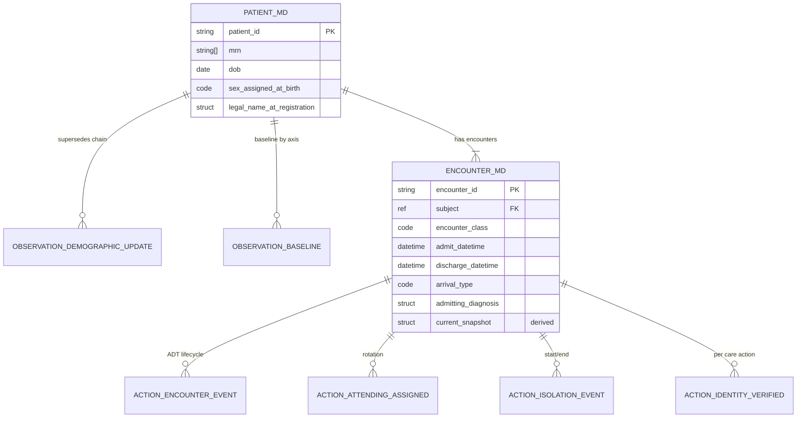

# A0a. Patient demographics, encounter context & baseline

## 1. Clinical purpose

Patient identity and the active episode are the substrate on which every other clinical event rests. Before any order, observation, or intervention is written, two questions must be answerable with certainty: **who is this patient** and **which encounter is this event scoped to**. Wrong-patient and wrong-encounter are never-events; they account for the highest-severity safety failures in medication administration, specimen labeling, and procedural consent. A0a also establishes the **baseline reference frame** against which acute change is interpreted — a creatinine of 1.8 mg/dL is dangerous in a patient with baseline 0.9, unremarkable in a patient with baseline 1.7; a confused patient is concerning if baseline-oriented, expected if baseline-demented. In the MICU septic-shock context, baseline weight anchors fluid balance and weight-based dosing, baseline creatinine anchors KDIGO AKI staging, baseline cognition anchors delirium detection, and baseline functional status anchors goals-of-care discussions. Demographics are not a banner — they are the scoping predicate for identity isolation, temporal attribution, and clinical interpretation of every event downstream.

## 2. Agent-native transposition

Patient demographics in a legacy EHR is a header row rendered above every screen: name, age, sex, MRN, allergy badges, code-status badges. That form is a UI artifact, not a substrate primitive. In pi-chart the underlying function decomposes into four distinct roles, and **it is load-bearing that these remain distinct**:

1. **Identity scope** for Invariant 6 (patient isolation). Every event's `subject` field must resolve to exactly one `patient.md`; the path itself is the scoping mechanism.
2. **Encounter anchor** for temporality. `effective_at` is meaningful only against a declared encounter — "day 3" or "post-op" are encounter-relative, not wall-clock.
3. **Baseline reference frame** for observation interpretation. "Current state" queries over observations need a baseline tag to distinguish acute change from chronic state. **Baseline is not just physiologic (weight, Cr) — it is cognitive and functional** (baseline oriented? baseline ambulatory? baseline home O2? baseline ADL-independent?).
4. **Identity/role resolution surface** for `author`, `reader`, `reviewer`, `attending_of_record`, `healthcare_proxy` across every event in the chart.

| Legacy EHR artifact | pi-chart primitive | Supporting views |
|---|---|---|
| Patient banner (top of chart) | `patient.md` structural subject + derived `currentState(axis:"subject")` | patientBanner (rendered) |
| Face sheet / registration page | `patient.md` YAML + event-stream `observation.demographic_update` | identityHistory |
| ADT log / encounter header | `encounter_NNN.md` structural + `action.encounter_*` events | encounterTimeline |
| Admission H&P baseline section | `observation.baseline` events tagged `baseline` (physiologic, cognitive, functional, respiratory) | baselineSet(axis) |
| Isolation / infection-control banner | Encounter-level `isolation_precautions` field + supersession on change | currentIsolation |
| Allergy / code-status badges | Links into A0b `constraint_set` | activeConstraints |
| Problem list header chips | Links into A0c | activeProblems |

The pi-agent **must read A0a first** before any write, because identity, encounter, and baseline together parameterize the validity of every subsequent event.

## 3. Regulatory / professional floor

- **TJC NPSG.01.01.01** — use at least two patient-specific identifiers (name, DOB, MRN, phone, government ID, photo) before medication, blood product, specimen collection, or treatment/procedure. Room/bed number is **explicitly not acceptable**. Applies at every care action, not once per encounter.
- **CMS 42 CFR 482.24(c)** — medical record content: patient name, address on admission, DOB, identification number, admitting diagnosis, date/time of admission and discharge, admitting physician, responsible party contact. Records retained ≥5 years. **42 CFR 482.24(c)(4)(i)** requires H&P within 24 hours of admission (or within 30 days before, but then updated within 24h).
- **CMS 42 CFR 482.13** — patient rights: advance directive notice on admission, language access, surrogate decision-maker acknowledgment, designated representative on admission.
- **ACA §1557 (CMS 2024 final rule)** — preferred language and interpreter need must be documented separately; qualified interpreters required for clinically significant communication with LEP patients.
- **USCDI v4 Patient Demographics/Information class** — the federal interoperability floor: first/middle/last/previous name, suffix, DOB, date of death, race (OMB), ethnicity, tribal affiliation, gender (male/female), language, phone (+ type), email, address, related-person name, relationship type, occupation, occupation industry.

## 4. Clinical function

Every clinical write requires prior identity resolution; every identity resolution requires the two-identifier rule; every two-identifier check reads `patient.md`. ICU admission is the triggering event for baseline establishment; baseline is multi-axis (physiologic, cognitive, functional, respiratory). Attending rotation changes owner-of-record for all subsequent writes. Unit transfer changes nurse-to-patient ratio, protocol library, pharmacy review scope, and isolation context.

- **Bedside RN** — identity verification at every medication pass, specimen collection, blood administration. Reads `currentState(subject)` + active `encounter` + `isolation_precautions` before room entry.
- **Attending MD / intensivist** — reads baseline for acute-vs-chronic reasoning. "Is this AMS new?" is the single most common ICU cognitive call and is unanswerable without `baseline_cognition`. Owns baseline-attribute writes on admission.
- **Pharmacist** — pharmacogenomic adjustments (ancestry-informed; HLA-B*57:01 screening prior to abacavir, CYP2D6 inference), weight-based dosing (vancomycin, heparin, vasopressors-per-kg), renal dosing against baseline Cr (not admission Cr — AKI would double-discount).
- **Respiratory therapist** — tidal-volume calculation uses predicted body weight from height (ARDSNet 6 mL/kg PBW); baseline respiratory support (home CPAP, home O2) distinguishes true deterioration from "return to baseline."
- **Case manager / social worker** — discharge planning starts from preferred language, living situation, healthcare proxy, baseline functional status (can they go home? SNF? LTACH?), and prior-encounter readmission patterns.
- **pi-agent** — reads `currentState(subject)` + active `encounter` + `baselineSet` + `activeConstraints` (A0b) + `activeProblems` (A0c) **before any write**. Without this, the write is unscoped and violates Invariant 6.

## 5. Who documents

Ownership is **intentionally split** (mirroring A1/A2's split between collecting agent and resulting agent):

- **Registration clerk** owns legal identity fields at first encounter: legal name, DOB, sex (administrative/recorded), MRN assignment, legal contact.
- **Attending or APP** owns baseline clinical attributes: baseline weight, baseline creatinine source, baseline respiratory support, baseline functional status, admitting diagnosis.
- **Admission nurse** owns baseline intake reliability: height/weight at admission, home medications list (feeds A4b), baseline cognition on arrival, functional status at admission, collateral history.
- **Patient or surrogate** owns self-reported identity fields: name, language, race/ethnicity, healthcare proxy designation.
- **ADT system / nursing charge** owns encounter-lifecycle events: admit, transfer between units, discharge, service change, isolation start/stop.
- **Credentialing / scheduling** owns attending-of-record assignment; it rotates and must be event-stamped.

Split ownership prevents the common EHR failure where registration-entered fields (patient's name as typed from ED triage in a different character set) silently overwrite self-reported fields.

## 6. When / how often

Demographics writes are **event-driven, not periodic**: registration at first encounter, demographic-update events (name change, language update, proxy change, address change). Encounter writes are event-driven by ADT triggers (HL7 A01 admit, A02 transfer, A03 discharge, A06 outpatient→inpatient class change, A08 update, A40 merge). Baseline writes are established **once per encounter on admission** and re-confirmed only when clinical reasoning demands — ICU practice norm is baseline weight/height within 1h of ICU arrival for unstable admits; regulatory minimum (H&P) is 24h.

The regulatory floor (NPSG.01.01.01) requires identity verification at **every care action**, not once per encounter. That is an agent-read obligation, not a new write; the two-identifier check reads `patient.md` and succeeds or fails based on presence of two identifiers, without producing a new demographic event.

Divergence: regulation establishes record existence, authentication, and H&P timing (24h). ICU practice demands a much smaller safety subset (identity + baseline + isolation + code status) **before the first clinical write**, which is typically <1h from admit for unstable patients.

## 7. Candidate data elements

### Subject — structural `patient.md` YAML + event-stream supersession

| Field | Layer | What fails if absent |
|---|---|---|
| `patient_id` (internal stable) | structural | Invariant 6 isolation cannot be enforced; every event's `subject` reference dangles |
| `mrn[]` (one or more external) | structural | Two-identifier rule fails for cross-system orders; merges become unresolvable |
| `legal_name` (given / middle / family / suffix) | structural at registration; updates via `observation.demographic_update` | Two-identifier rule fails; wristband cannot be generated |
| `preferred_name`,  | event-stream (HL7 GH: NtU) | Care quality / patient-experience harm; not a safety block |
| `dob` | structural, immutable | Two-identifier rule fails; age-based dosing (peds, geriatric) fails |
| `gender` | structural | Reference ranges (hemoglobin, creatinine, eGFR) wrong; pharmacogenomics wrong |
| `gender` (SPCU) | event-stream, context-bound | Lab-specific reference ranges and imaging context wrong |
| `language` | event-stream | §1557 violation; consent invalid; critical-miss on informed consent |
| `interpreter_needed` (boolean + modality: spoken/ASL/tactile) | event-stream | Preferred-language-of-English ≠ "no interpreter needed" (deaf patient); preferred-Spanish ≠ "needs interpreter" (bilingual family available). §1557 operationalization requires this to be separate from `preferred_language` |
| `race[]` / `ethnicity[]` (OMB 2024, multi-select) | event-stream, self-reported | Pharmacogenomic inference, equity audit, risk stratification degraded |
| `healthcare_proxy` (name, relationship, contact, authority source) | event-stream | High-stakes decisions in incapacitated patient blocked |
| `emergency_contact` | event-stream | Notification obligations on deterioration blocked |
| `baseline_weight_kg` | **observation event** `tags=["baseline","physiologic"]` | Weight-based dosing blocked (vancomycin, heparin, vasopressors-per-kg); fluid balance targets absent; ARDSNet PBW tidal-volume targeting blocked when paired with height |
| `baseline_height_cm`, derived BMI | **observation event** `tags=["baseline","physiologic"]` | PBW-based tidal volume (6 mL/kg ARDSNet) blocked; BSA-based dosing blocked |
| `baseline_creatinine_mg_dL` (+ source: prior outpatient / back-calculated eGFR=75) | **observation event** `tags=["baseline","renal"]` | KDIGO AKI staging wrong; renal dosing wrong |
| `baseline_cognition` (oriented / baseline-impaired + type: dementia, developmental, TBI) | **observation event** `tags=["baseline","cognitive"]` | Delirium detection impossible; CAM-ICU screening uncalibrated; "new AMS" indistinguishable from baseline dementia; consent capacity assessment lacks anchor |
| `baseline_functional_status` (ADLs independent / assisted; ambulation; home devices) | **observation event** `tags=["baseline","functional"]` | Falls risk uncalibrated; discharge disposition reasoning lacks anchor; early mobility protocol inappropriately applied |
| `baseline_respiratory_support` (home O2 L/min, home CPAP/BiPAP settings, home vent, trach) | **observation event** `tags=["baseline","respiratory"]` | ICU respiratory deterioration over- or under-called; oxygen escalation decisions unframed; weaning trajectory miscalibrated |
| `allergies_link` → A0b | structural link | — (delegated to A0b) |
| `code_status_link` → A0b | structural link | — (delegated to A0b) |
| `problems_link` → A0c | structural link | — (delegated to A0c) |

### Encounter — structural `encounter_NNN.md` YAML + event-stream ADT actions

| Field | Layer | What fails if absent |
|---|---|---|
| `encounter_id` | structural | Every event's `encounter_id` reference dangles; temporality unscoped |
| `encounter_class` (IMP / EMER / OBSENC / AMB, per FHIR v3-ActCode) | structural | Protocol library, bed-management, billing wrong |
| `admit_datetime` / `discharge_datetime` | structural; discharge set by A03 event | **Every event's `effective_at` alignment depends on this**; LOS, day-of-admission reasoning, time-based openLoops all break without it |
| `arrival_type` / `admit_source` (UB-04 POO: ED, direct, transfer_from_external_hospital, transfer_from_floor, transfer_from_OR, readmission_within_30d) | structural | Risk stratification fails (ED admits carry higher sepsis prevalence; transfer-from-external carries different medication-reconciliation scope and infection-surveillance implications); readmission attribution for HRRP wrong |
| `current_location` (unit + bed; e.g., MICU-7) | **event-stream** via `action.encounter_transferred`; structural YAML holds latest snapshot | Nurse-scope, protocol scope, code-team routing, monitor-stream attribution wrong. Room/bed is NEVER a patient identifier (NPSG.01.01.01) but IS a clinical-context field |
| `attending_of_record` | event-stream via `action.attending_assigned` | Ownership-of-record absent; orders unsignable; notification routing fails |
| `service` (medicine, surgery, trauma, MICU, SICU) | event-stream via `action.service_changed` | Consult routing, care-team scope wrong |
| `admitting_diagnosis` (ICD-10 + free-text) | structural | §482.24(c) violation; problem-list reconciliation with A0c blocked |
| `isolation_precautions[]` (type: contact/droplet/airborne/neutropenic + reason + start) | **event-stream** via `action.isolation_started` / `isolation_ended`; structural YAML holds current set | Bed assignment, PPE, procedure workflow, visitor policy all unsafe if unknown; infection control breach risk |
| `prior_encounter_links[]` | structural | Readmission-window reasoning, baseline inheritance broken |

A0a lands ~21 included fields across subject + encounter. Charter budget is 8–20; this slightly exceeds the ceiling because A0a is genuinely the broadest foundational artifact (two structural types + event-stream overlay). The encounter-level isolation set and the four baseline axes (physiologic/cognitive/functional/respiratory) are the reason; none are trimmable without breaking downstream ICU reasoning.

## 8. Excluded cruft

| Field | Why EHRs capture it | Why excluded from pi-chart |
|---|---|---|
| Social Security Number | Billing, identity-proofing, cross-system matching | Identity-theft vector; unneeded at ICU bedside; MRN + name + DOB sufficient for NPSG.01.01.01 |
| Full mailing address (multi-line home/billing/work) | Discharge mailers, billing statements | Not needed for ICU clinical decisions; one address field suffices and only at discharge planning |
| Marital status | Legacy surrogate-ID shorthand, insurance | `healthcare_proxy` captures the clinically relevant fact directly |
| Religion | Legacy pastoral-care routing | When religion affects care (JW + blood refusal), it belongs in A0b constraints, not demographics |
| Occupation / industry | Required by USCDI v4 for occupational-health linkage | Low clinical yield in MICU context; collect at discharge if needed |
| Employer / guarantor / insurance plan / subscriber | Revenue cycle, billing, eligibility, prior authorization | Billing-only; orthogonal to clinical substrate |
| CSN / visit financial number / account number | Hospital billing encounter grouping | `encounter_id` is the clinical episode key; financial identifiers are external |
| Room/bed **as identifier** | Human navigation, unit operations | Actively unsafe as a patient identifier (NPSG.01.01.01 explicit prohibition); location IS retained as clinical-context field, but not as identifier |
| Patient photo | Visual verification in portals/registration | UI affordance, not canonical claim |
| Full registration audit trail | Compliance/revenue audit | Envelope-level `source`/`author`/`recorded_at` cover claim provenance |
| Repeated patient header on every note/flowsheet row | Paper-form inheritance, print/fax safety | `subject` is envelope-level, inherited by storage scope |
| VIP / confidentiality flags | Access control, privacy operations | Access-control policy is not a clinical claim in Phase A |
| Portal username / account status | Patient engagement operations | Not relevant to ICU simulation memory |
| Form-of-address / salutation (Mr./Dr./Rev.) | Letterhead, mailers | No clinical function |
| Multiple telecom entries (home/work/cell/fax) | Legacy contact redundancy | One preferred phone + one emergency contact suffices |

Each exclusion is conditional: the moment a cruft field becomes clinically relevant (JW + blood, teacher in pediatric outbreak, occupational lung exposure) it is reintroduced as a **constraint** (A0b) or a **problem** (A0c), not as a demographic field.

## 9. Canonical / derived / rendered

This is where the central design tension resolves. A0a declares a **two-layer canonical form**.

**Canonical (structural layer — immutable except by supersession):**
- `patient.md` YAML frontmatter carrying only **identity-stable** fields: `patient_id`, `dob`, `sex_assigned_at_birth`, `mrn[]`, `legal_name_at_registration`. Written once at first registration; subsequent legal-name changes are event-stream, not overwrites.
- `encounter_NNN.md` YAML frontmatter carrying **encounter-stable** fields: `encounter_id`, `encounter_class`, `admit_datetime`, `arrival_type`, `admitting_diagnosis`. The YAML also holds **latest snapshots** of mutable encounter fields (`current_location`, `attending_of_record`, `service`, `isolation_precautions[]`) for rendering performance, but the authoritative source is the event stream — snapshots are derived.

**Canonical (event-stream layer — full envelope):**
- `observation.subtype=demographic_update` — supersedes prior value of a named mutable field (preferred_name, preferred_language, interpreter_needed, race, ethnicity, gender, healthcare_proxy, emergency_contact, address). Full envelope per CLAIM-TYPES.md event types, with `links.supersedes` to the prior value's event ID.
- `observation.subtype=baseline` with `tags=["baseline", "<axis>"]` — carries a clinical attribute. Axes: `physiologic` (weight, height, BMI), `renal` (creatinine, eGFR source), `cognitive` (baseline orientation, known dementia), `functional` (ADL independence, ambulation), `respiratory` (home O2, home CPAP, home vent).
- `action.subtype=encounter_admitted` / `encounter_transferred` / `encounter_discharged` / `attending_assigned` / `service_changed` / `isolation_started` / `isolation_ended` — full-envelope action events. Carry effector (clerk, charge RN, ADT interface), `effective_at` (when the clinical event happened, not when the message arrived), and payload (prior_location, new_location, etc.).
- `action.subtype=identity_verified` — a care-action-scoped verification claim produced at every NPSG.01.01.01 checkpoint.

**Derived (query-time projections, never written to disk):**
- `currentState(axis:"subject")` → structural YAML + latest unsuperseded demographic_update events overlaid.
- `currentState(axis:"encounter")` → active encounter with latest location, attending, service, isolation-set overlaid from action events.
- `baselineSet(axis:"<domain>")` → union of baseline-tagged observations, filtered by domain (physiologic, renal, cognitive, functional, respiratory).
- `readPatientContext()` → convenience aggregator returning subject + active encounter + all baseline axes + links to A0b/A0c. This is the single most-called read in the substrate.
- `age(asOf:<time>)` → computed from `dob` at reference time; never stored.
- `bmi` → computed from latest baseline weight + height; never stored.
- `readmission_within_30d(referenceEncounter)` → computed over `prior_encounter_links`.

**Rendered:**
- **patientBanner** — name, age, sex-for-clinical-use, MRN, allergy/code-status badges (A0b), active problems chips (A0c), isolation flag. A view, not a file.
- **encounterHeader** — class, unit, attending, admit day N.
- **baselinePanel** — baseline vitals/labs/weight/cognition shown alongside current values for delta reasoning.

The invariant: **if the derived view disagrees with the canonical layer, the canonical layer is authoritative**. Every rendered banner is reproducible from the canonical stream.

## 10. Provenance and lifecycle

Proposed `source.kind` enum:

- `registration_system` — clerk at intake (legal identity)
- `adt_interface_hl7` — A01/A02/A03/A08/A40 messages from a hospital ADT stream
- `admission_intake` — RN admission-intake form (baseline cognition, functional status, home meds, home respiratory support)
- `patient_statement` — self-report (preferred name, gender, race, ethnicity, language, healthcare proxy preference)
- `surrogate_statement` — when patient lacks capacity
- `clinician_direct` — attending/APP for baseline clinical attributes
- `imported_synthea` — synthetic Synthea patient-module generation (ADR 001 primary path)
- `imported_mimic` — MIMIC-IV `patients`/`admissions`/`transfers` mapping (deferred per ADR 001)
- `manual_scenario` — hand-crafted calibration fixtures

**Lifecycle rules:**
- Identity-stable fields (`patient_id`, `dob`, `sex_assigned_at_birth`, first MRN): created once at registration; **never updated** in place. Correction of an error goes through `observation.demographic_update` with `source.kind=data_correction` and `links.supersedes` — BUT structural YAML itself cannot carry `links.supersedes` per CLAIM-TYPES.md's lightweight envelope. See §16 Q6.
- Encounter: created at admission (A01 or A04), sealed at discharge (A03). Retrospective edits via supersession events, not in-place mutation.
- Demographic mutable fields: supersede-only. Previous values remain visible for audit.
- Baseline attributes: re-established each new encounter; prior encounter's baseline may be inherited on short-interval readmission (policy threshold: commonly 30 days, per HRRP window alignment).
- Patient merge (HL7 A40): the losing `patient_id` is retired with a `link.replaced-by` pointer to the surviving `patient_id`; no events are rewritten.

**Staleness:**
- Identity-stable fields do not stale.
- Demographic mutable fields generally do not stale, with exceptions: `preferred_language` may stale if clinical deterioration changes communication ability; `healthcare_proxy` stales if the named proxy becomes unreachable or declines.
- **Baseline clinical attributes stale by encounter and by axis.** Baseline weight stales at encounter boundary. Baseline Cr stales per KDIGO at ~365 days or on a new AKI event. Baseline cognition stales on major neurologic event. Baseline respiratory support stales on major respiratory event.
- Encounter becomes stale when active but has no progress note or assessment within 48h on unstable patient (H&P-update spirit).

**Contradictions:**
- Two MRNs referring to the same person → merge via A40; lossless linkage preserved.

- `patient.md` preferred language says English but admission intake says Spanish interpreter needed → **preserve both, warn**; latest reviewed admission intake supersedes for active encounter.
- Encounter location says floor but monitor stream source says ICU device → `warn`; require encounter/location reconciliation.
- Baseline home O2 unknown but current oxygen plan assumes "new oxygen requirement" → `warn`; create openLoop for baseline clarification.
- Isolation precautions conflict between admission header and infection-control note → require review; use explicit supersession if one is discontinued.

## 11. Missingness / staleness

Critical-missing conditions open loops:

- **OL-IDENTITY-01** — two-identifier check cannot complete (missing DOB or missing name). **Blocks every clinical write** (`action.medication_admin`, `specimen_collected`, `imaging_acquired`, `procedure_performed`). Severity: critical. Resolves when two identifiers are present and verified.
- **OL-IDENTITY-02** — preferred language unspecified OR `interpreter_needed` unspecified AND at least one behavioral signal of limited English proficiency. Triggers interpreter request; blocks informed-consent events until resolved or language+interpreter status confirmed.
- **OL-IDENTITY-03** — healthcare proxy unspecified AND patient intubated/sedated/has documented incapacity. Blocks high-stakes decisions (procedural consent, goals-of-care change, withdrawal).
- **OL-IDENTITY-04** — patient merge pending (two candidate MRNs in the chart, no A40 resolution). Blocks any write until the merge target is explicit.
- **OL-ENCOUNTER-01** — attending of record not assigned within policy window (commonly 4 h) of admission. Orders cannot be finalized.
- **OL-ENCOUNTER-02** — baseline weight missing after admission policy window (commonly 4 h for ICU, 1 h for patients on vasopressors). Blocks weight-based dosing and fluid targets.
- **OL-ENCOUNTER-03** — admitting diagnosis missing. Violates §482.24(c); blocks problem-list reconciliation with A0c.
- **OL-ENCOUNTER-04** — baseline creatinine unavailable AND back-calculation fallback (MDRD eGFR=75 per KDIGO) not yet computed. Degrades AKI staging to "cannot be staged."
- **OL-ENCOUNTER-05** — isolation precautions unspecified on admission AND infectious-concern signal present (fever, respiratory symptoms, MDRO history, transfer from long-term care). Blocks bed assignment finalization and triggers infection-control review.
- **OL-BASELINE-01** — baseline cognition unspecified AND patient presenting with AMS or delirium-risk factors. Delirium detection (CAM-ICU) lacks anchor; consent-capacity assessment lacks anchor.
- **OL-BASELINE-02** — baseline respiratory support unspecified AND patient on any supplemental oxygen. "New oxygen requirement vs return to baseline" undecidable; weaning trajectory miscalibrated.

Naming pattern parallels A1/A2's `OL-RESULT-*` family. Identity loops travel with the patient across encounters; encounter and baseline loops expire at discharge.

## 12. Agent read-before-write context

Before any write, the pi-agent executes:

1. `readPatientContext(scope)` — the aggregate call that returns `subject`, active `encounter`, all baseline axes, and link pointers to A0b/A0c. This is the canonical single read for every agent decision cycle.
2. `currentState(axis:"subject")` — if a more specific identity check is needed (two-identifier rule).
3. `currentState(axis:"encounter")` — confirms the active encounter, current unit, current attending, current isolation set; populates `encounter_id`.
4. `baselineSet(axis:<relevant-domain>)` — fetches baseline weight for a weight-based dose, baseline Cr for a renal dose, baseline cognition for a neuro assessment, baseline vitals for observation interpretation.
5. `readActiveConstraints()` (→ A0b) — allergies, code status, precautions, blood-product restrictions.
6. `activeProblems()` (→ A0c) — comorbidities that shape interpretation (baseline CKD for K trend, baseline CHF for fluid targets).

Before **ADT writes** specifically, additionally:

7. `priorEncounters(patient, window:30d)` — for readmission attribution and baseline inheritance decisions.

Before **care-action writes** (medication_admin, specimen_collected, imaging_acquired, procedure_performed, blood_product_administered), additionally:

8. Verify that a preceding `action.identity_verified` exists within the current care-action window; if not, emit one before the care action (this is how NPSG.01.01.01 operationalizes — see V-ID-07).

**Write-side rule:** no event append proceeds unless `event.subject` matches the patient directory AND the active `encounter_id` exists OR is explicitly not applicable to the structural file being created. No write proceeds if any critical-miss openLoop is active on A0a.

## 13. Related artifacts

A0a is referenced by **every other artifact**. Direct dependencies:

- **A0b (constraints)** — `allergies_link`, `code_status_link` from `patient.md`; constraints scoped by `subject` and (often) `encounter_id`. A0b depends on A0a.
- **A0c (problems)** — `problems_link` from `patient.md`; problems scoped by `subject`, optionally with encounter-onset. A0c depends on A0a.
- **A1 (lab results), A2 (imaging/procedures)** and every clinical event type — all envelopes carry `subject` (resolves to `patient.md`) and `encounter_id` (resolves to `encounter_NNN.md`). A0a defines what those references mean.
- **A4b (medication reconciliation)** — consumes `arrival_type` + home medication list (captured during admission intake).
- **A3 vitals, A4 MAR, A5 LDAs, A8 nursing assessment** — all consume baseline reference frames for acute-vs-chronic interpretation.

The inverse dependency matters: A0a is **consumed by** the baseline-reference logic of A1 (baseline Cr shapes AKI staging), by the wrong-patient guard of every write, and by the encounter-scoping of temporal views. A0a is the root of the substrate's referential graph.

## 14. Proposed pi-chart slot shape

### Two-layer structure

**Layer 1 — structural YAML (lightweight envelope per CLAIM-TYPES.md):**
- `patient.md` with structural type `subject` carrying identity-stable fields only, plus link pointers to A0b/A0c.
- `encounter_NNN.md` with structural type `encounter` carrying encounter-stable fields plus a **derived snapshot** of latest location/attending/service/isolation-set (for rendering performance; authoritative source is the event stream).

**Layer 2 — event-stream (full envelope per CLAIM-TYPES.md event types):**
- `observation.demographic_update` for mutable demographic fields (supersession-based).
- `observation.baseline` (with `tags=["baseline", "<axis>"]`) for clinical baseline attributes across five axes (physiologic, renal, cognitive, functional, respiratory).
- `action.encounter_admitted` / `encounter_transferred` / `encounter_discharged` / `attending_assigned` / `service_changed` / `isolation_started` / `isolation_ended` for ADT lifecycle.
- `action.identity_verified` at every care-action checkpoint.

### Examples

**(a) `patient.md` YAML — identity-stable core**

```jsonc
// patient.md frontmatter
{
  "chart_type": "subject",
  "patient_id": "pi-patient-00423",
  "mrn": [
    {"system": "hospital-legacy", "value": "LEG-7781234"},
    {"system": "enterprise", "value": "ENT-000-9921-B"}
  ],
  "dob": "1958-04-12",
  "gender": "male",
  "legal_name_at_registration": {
    "given": ["Michael", "Andrew"],
    "family": "Okonkwo",
    "suffix": null
  },
  "links": {
    "allergies": "constraints.md#allergies",
    "code_status": "constraints.md#code_status",
    "problems": "problems.md"
  },
  "provenance": {
    "source": {"kind": "registration_system", "actor": "reg-clerk-042"},
    "recorded_at": "2026-04-18T03:14:00Z"
  }
}
```

**(b) `encounter_001.md` YAML — encounter-stable core + derived snapshot**

```jsonc
// timeline/2026-04-18/encounter_001.md frontmatter
{
  "chart_type": "encounter",
  "encounter_id": "enc-00423-001",
  "subject": "pi-patient-00423",
  "encounter_class": "IMP",            // FHIR v3-ActCode
  "admit_datetime": "2026-04-18T02:51:00Z",
  "discharge_datetime": null,
  "arrival_type": "transfer_from_ed",  // ED | direct | transfer_from_external_hospital | transfer_from_floor | transfer_from_OR | readmission_within_30d
  "admitting_diagnosis": {
    "icd10": "A41.9",
    "text": "Septic shock, suspected pulmonary source"
  },
  "current_snapshot": {                // DERIVED; authoritative source is event stream
    "location": {"unit": "MICU", "bed": "7"},
    "attending_of_record": "dr-chen-b",
    "service": "medicine-micu",
    "isolation_precautions": [
      {"type": "droplet", "reason": "respiratory viral rule-out", "started_at": "2026-04-18T02:55:00Z"}
    ]
  },
  "prior_encounter_links": ["enc-00423-2025-11-03"]
}
```

**(c) `observation.demographic_update` — preferred-name change**

```jsonc
{
  "id": "evt-7f3a",
  "type": "observation",
  "subtype": "demographic_update",
  "subject": "pi-patient-00423",
  "encounter_id": "enc-00423-001",
  "effective_at": "2026-04-19T09:12:00Z",
  "recorded_at": "2026-04-19T09:12:00Z",
  "data": {
    "field": "preferred_name",
    "value": {"given": ["Mika"], "family": "Okonkwo"},
  },
  "links": {"supersedes": "evt-2b11"},
  "source": {"kind": "patient_statement", "actor": "pi-patient-00423"},
  "certainty": "asserted",
  "tags": ["identity"]
}
```

**(d) `action.encounter_transferred` — ED → MICU**

```jsonc
{
  "id": "evt-3c22",
  "type": "action",
  "subtype": "encounter_transferred",
  "subject": "pi-patient-00423",
  "encounter_id": "enc-00423-001",
  "effective_at": "2026-04-18T04:08:00Z",
  "recorded_at": "2026-04-18T04:11:00Z",
  "data": {
    "prior_location": {"unit": "ED", "bed": "ED-12"},
    "new_location":   {"unit": "MICU", "bed": "7"},
    "service_before": "emergency",
    "service_after":  "medicine-micu",
    "reason": "escalation-septic-shock"
  },
  "source": {"kind": "adt_interface_hl7", "message": "ADT^A02"},
  "certainty": "asserted",
  "tags": ["adt", "transfer"]
}
```

**(e) `observation.baseline` — baseline cognition (ICU-relevant new axis)**

```jsonc
{
  "id": "evt-9f01",
  "type": "observation",
  "subtype": "baseline",
  "subject": "pi-patient-00423",
  "encounter_id": "enc-00423-001",
  "effective_at": "2026-04-18T04:40:00Z",
  "data": {
    "axis": "cognitive",
    "attribute": "baseline_orientation",
    "value": "oriented_to_person_place_time",
    "known_impairments": [],
    "source_note": "family confirms patient normally lucid at baseline; no dementia diagnosis"
  },
  "source": {"kind": "admission_intake", "actor": "rn-wilson-c", "informant": "patient_spouse"},
  "certainty": "asserted",
  "tags": ["baseline", "cognitive"]
}
```

### Mermaid — two-layer relationship



**`schema_confidence: medium`** — the two-layer split is deliberate and defensible, but the boundary between "identity-stable" and "mutable" carries judgment calls, and **structural correction semantics remain open** (§16 Q6). **`schema_impact: high`** — A0a is the first artifact to operationalize the structural-vs-event-stream split declared in CLAIM-TYPES.md, and every downstream artifact (A0b, A0c, A1, A2, all of Batch 2 and 3) inherits this pattern.

## 15. Validator and fixture implications

**Validator rules:**

- **V-ID-01** — `patient.md` MUST contain non-empty `patient_id`, `dob`, `sex_assigned_at_birth`, `legal_name_at_registration`, and at least one `mrn[]` entry. Violations block chart initialization.
- **V-ID-02** — Every event's `subject` MUST resolve to a `patient.md` at the expected path (Invariant 6). Cross-patient references are a hard fail.
- **V-ID-03** — Every event's `encounter_id` MUST resolve to a valid `encounter_*.md` belonging to the same `subject`, OR be explicitly null for pre-encounter/structural events.
- **V-ID-04** — `observation.subtype=demographic_update` MUST carry `links.supersedes` pointing to the prior event for the same `data.field`, OR be the first event for that field.
- **V-ID-05** — `action.subtype=encounter_transferred` MUST carry `data.prior_location` + `data.new_location`; `data.prior_location` MUST equal the encounter's current location at `effective_at` (monotonicity check).
- **V-ID-06** — `observation.subtype=baseline` MUST carry `tags` including `"baseline"` AND `data.axis` in {physiologic, renal, cognitive, functional, respiratory} AND `data.attribute` naming a recognized clinical attribute.
- **V-ID-07** (cross-cutting with A0b) — Any care action (`action.subtype ∈ {medication_admin, specimen_collected, imaging_acquired, procedure_performed, blood_product_administered}`) MUST be preceded within its care-action window by an `action.identity_verified` event referencing at least two of {name, dob, mrn, photo}. Room/bed is NEVER an acceptable identifier. This is how NPSG.01.01.01 operationalizes in the substrate.
- **V-ID-08** — A `patient.md` merge (A40) MUST produce a `link.replaced-by` on the losing record; no events on the losing record may be rewritten.
- **V-ID-09** (cross-artifact, calibration-critical) — No medication `intent` or `action` may be committed unless `currentState(axis:"constraints")` has been read in the current agent decision cycle AND no active allergy/intolerance conflict exists for the proposed agent. Parallel rules for diet orders vs dietary constraints, transfusion orders vs blood-product restrictions, resuscitation orders vs code status. **This is the operational form of the read-before-write discipline.**
- **V-ID-10** — `encounter_NNN.md` MUST carry `admit_datetime`; all events with `encounter_id = enc-X` must have `effective_at >= enc-X.admit_datetime` (temporal monotonicity).
- **V-ENC-ISO-01** — `action.subtype=isolation_started` must carry `data.type` ∈ {contact, droplet, airborne, neutropenic, contact_plus, special}; `action.subtype=isolation_ended` must reference a prior `isolation_started` via `links.supersedes` or equivalent.

**Minimal fixture set (6 scenarios, MICU septic-shock context):**

1. **Admission-to-MICU chain**. Registration writes `patient.md`. ED encounter `enc-...-001` created. `action.encounter_admitted` (ED). `action.encounter_transferred` ED→MICU. `action.attending_assigned` (MICU intensivist). `action.isolation_started` (droplet, respiratory viral rule-out). `observation.baseline` × 5 axes (weight 82 kg, height 178 cm, creatinine 1.1 back-calc, cognition oriented baseline, respiratory no home O2). Validates full V-ID-01…06, V-ID-10, V-ENC-ISO-01.
3. **Unit transfer MICU → SICU for exploratory laparotomy**. `action.encounter_transferred`, `action.service_changed` (medicine-micu → surgery), `action.attending_assigned` (surgical attending). Validates V-ID-05 monotonicity.
4. **Two-identifier operationalization for high-risk med admin (and cross-artifact V-ID-09)**. Before a norepinephrine bolus write: an `action.identity_verified` event must exist AND `currentState(axis:"constraints")` must have been read with no norepinephrine-relevant allergy. A failure fixture omits the verification and confirms V-ID-07 blocks; a second failure fixture omits the constraint read and confirms V-ID-09 blocks.
5. **Healthcare-proxy activation on loss of capacity**. Patient intubated, sedated. `observation.demographic_update` on `healthcare_proxy` (documented in advance directive). Couples to A0b code-status re-confirmation. Confirms OL-IDENTITY-03 resolves.
6. **Readmission within 30 days with baseline inheritance**. Two months later: no inheritance. Two weeks later: new encounter `enc-...-002` with `prior_encounter_links=["enc-...-001"]`; `baselineSet` query returns baseline creatinine from prior encounter with provenance intact; pneumonia-readmission qualifies for HRRP cohort. Validates OL-ENCOUNTER-04 resolution via inheritance.

## 16. Open schema questions

1. **[open-schema] Two-layer structural vs event-stream split (the core question for A0a).** Is the recommended hybrid (identity-stable structural YAML + mutable event-stream with supersession) correct, or should the substrate commit to everything-as-events (uniform, heavier) or everything-as-structural (lighter, but lossy on lifecycle and provenance)? Current recommendation: hybrid, with explicit boundary rules. Feeds OPEN-SCHEMA-QUESTIONS.md and propagates to A0b/A0c design.

2. **[open-schema] Race/ethnicity representation across OMB 1997 and OMB 2024.** OMB SPD 15 revised March 2024 combines race and ethnicity into a single multi-select question with seven minimum categories (adds Middle Eastern or North African; federal compliance by March 28, 2029). Should pi-chart adopt OMB 2024 natively, preserve OMB 1997 for legacy import fidelity, or support both with a `standard_version` field per value set? Clinical relevance: pharmacogenomic inference, disease-risk stratification, equity audit. Current lean: OMB 2024 as canonical, with OMB 1997 preserved on import from pre-2029 sources.

3. **[open-schema] Baseline attributes — `observation.baseline` tagged axes vs a `baseline_set` structural type.** The recommendation above models baselines as observations with `tags=["baseline", "<axis>"]`. Alternative: a `baseline_set` structural type parallel to `constraint_set`, giving baselines first-class structural status. Trade-off: tags are flexible and reuse existing query infrastructure, but push a semantic concept ("baseline") into tag space rather than type space. Current lean: stay with tagged observations; revisit if tag-based queries prove fragile.

4. **[open-schema] ADT as actions vs encounter supersession.** `action.encounter_transferred` is event-style, matching HL7 ADT's inherently event-based semantics (A01, A02, A03 are triggers, not states). Alternative: represent a transfer as a supersession of `encounter_001.md` by `encounter_002.md`. HL7 explicitly rejects the supersession model at the encounter boundary in favor of event triggers; pi-chart adopts the action model. Open question: does any clinical workflow require encounter supersession (e.g., administrative encounter-class correction after billing review)? If yes, `action.encounter_class_corrected` handles it; a full encounter supersession primitive is probably unneeded.

5. **[open-schema] Sex / gender model — four fields or five?** - FINAL DECISION - GENDER = Male/Female

6. **[open-schema] Structural correction semantics.** CLAIM-TYPES.md assigns structural types a lightweight envelope — no required `data`/`links`/`encounter_id`/`certainty`. But a wrong DOB in `patient.md`, or a wrong admit_datetime in `encounter_NNN.md`, needs to be correctable with provenance. Three candidate models:
   - **(a) Mutable frontmatter with in-file provenance trail.** The YAML is updated in place and carries a `revisions[]` array.
   - **(b) Versioned structural files.** A new `patient.md` version with a `supersedes: <prior_hash>` pointer; old versions preserved.
   - **(c) Correction events.** `observation.demographic_update` with `source.kind=data_correction` supersedes the prior value; structural file is regenerated from the event stream.
   Current lean: (c) for mutable fields (already the recommended pattern) + (b) for identity-stable fields that require structural-level corrections (DOB typo, sex_assigned_at_birth correction). Avoids in-place mutation entirely.

7. **[open-schema] Location/level-of-care as action-based events vs interval `observation.context_segment`.** The recommendation above uses `action.encounter_transferred` events feeding a derived snapshot in the encounter YAML. Alternative: represent each location/unit stay as an `observation.subtype=context_segment` with a period (start/end), giving location intervals first-class status for trend-over-stay queries ("how much time did this patient spend in MICU vs SICU vs step-down?"). Similar framing applies to isolation intervals. Trade-off: action-events are simpler and match HL7 ADT; context_segments are better for analytics over stays. Current lean: action-events for ADT; context_segments as a Phase B candidate if stay-analytics needs justify it.

## 17. Sources

HL7 FHIR R5 Patient, Encounter, EpisodeOfCare, Location resources (hl7.org/fhir/R5). USCDI v4 (ONC, July 2023) Patient Demographics/Information data class (healthit.gov/isa). OMB Statistical Policy Directive No. 15, 1997 revision and 2024 revision (Federal Register 2024-06469, March 29, 2024). The Joint Commission NPSG.01.01.01 Elements of Performance and interpretive FAQs (jointcommission.org). TJC PC.01.02.03 / AOP.1 on admission assessment. CMS 42 CFR 482.24 (medical record services, including §482.24(c)(4)(i) on H&P timing), 42 CFR 482.13 (patient rights and designated representative), 42 CFR 489.102 (advance directive notice). ACA §1557 and CMS 2024 final rule on language access / LEP. KDIGO 2012 Clinical Practice Guideline for Acute Kidney Injury (baseline creatinine operationalization, MDRD back-calculation at eGFR 75). ARDSNet tidal-volume protocol (6 mL/kg predicted body weight, requires height) — ARDS Network, NEJM 2000. CAM-ICU and ICDSC for ICU delirium screening (both require baseline cognitive status anchor). Society of Critical Care Medicine ICU Admission, Discharge, and Triage Guidelines (Crit Care Med 2016). CMS Hospital Readmissions Reduction Program (HRRP) measure specifications, FY 2012 IPPS final rule and subsequent updates. NIH All of Us Research Program demographic standards. HL7 v2.5/2.7 ADT message specification, trigger events A01–A40, segments PV1 and MRG. HL7 v3 ActEncounterCode value set (terminology.hl7.org). MIMIC-IV hosp module documentation for `patients`, `admissions`, and `transfers` tables (mimic.mit.edu/docs/iv). Synthea patient demographics module and `patients.csv` exporter schema (github.com/synthetichealth/synthea). WHO Patient Safety Solution #2 (patient identification). Repository: `PHASE-A-CHARTER.md`, `PHASE-A-TEMPLATE.md`, `PHASE-A-EXECUTION.md v3.2`, `CLAIM-TYPES.md`, `DESIGN.md`, `README.md`; `a1-lab-results.md` and `a2-results-review.md` (cross-artifact open-question alignment).
