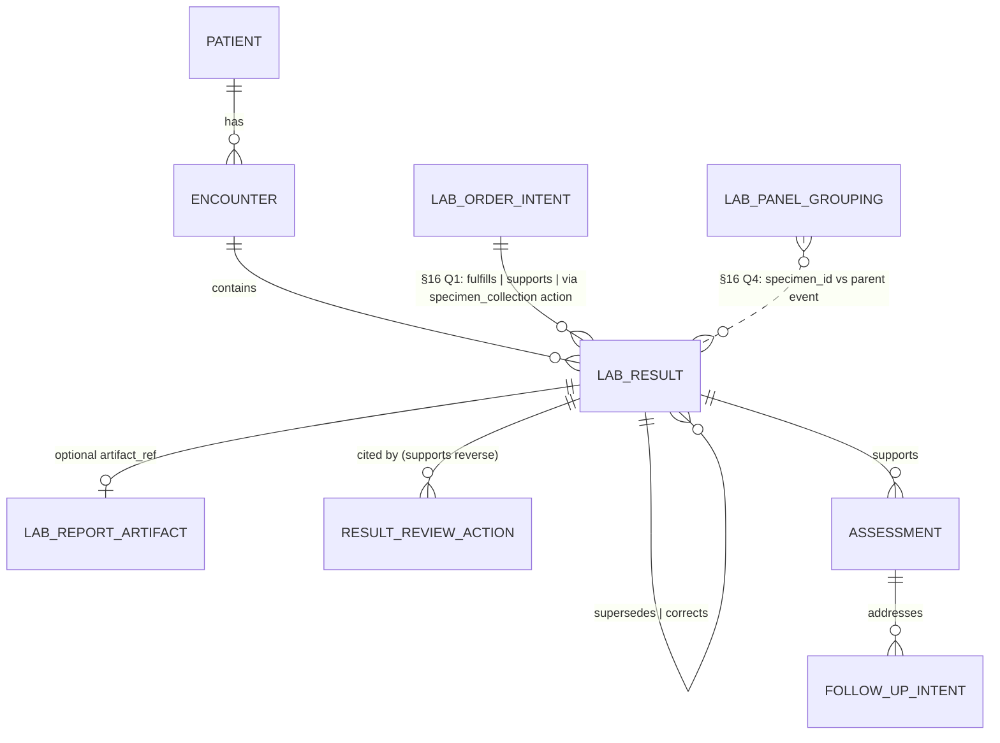

# A1. Lab results flowsheet

## 1. Clinical purpose

A lab results flowsheet exists so that a clinician can, at a glance and across time, answer three questions about a patient's internal physiologic state: *what is true right now*, *how is it changing*, and *what outside-normal findings demand action*. Its function is not tabular display — it is the compressed, time-ordered, directionally-flagged record of discrete chemical, hematologic, and microbiologic measurements on patient-derived specimens, together with the provenance needed to trust each value (who measured it, when, on what specimen, against what reference interval, with what revisions since). Everything visually distinctive about a conventional flowsheet (column-per-draw, red for critical, bold for abnormal, panel grouping) is a rendering of that underlying evidence stream, not the stream itself.

## 2. Agent-native transposition

The lab results flowsheet is not a view in pi-chart. It is not even a table. In pi-chart, what a flowsheet *is* decomposes into three distinct functions served by one primitive and six views:

- A **time-indexed evidence substrate for physiologic state** — each result is a discrete `observation` event with a payload binding analyte → value → unit → reference interval → specimen → resulted_at. The evidence is the event stream; the flowsheet is a projection of it.
- A **supersession lifecycle** for corrected, amended, and delta-flagged results — captured by `links.supersedes` / `links.corrects`, so the chart never loses the pre-correction value that a prior assessment may have cited.
- A **trigger surface** for downstream intents, actions, and communications — a critical potassium is not just an abnormal number; it is a read-before-write input that opens a result-review loop and usually obliges a new intent (K replacement) and a communication (critical-value callback). Openness of that loop is itself a queryable state, not a render.

| Legacy artifact | pi-chart primitive | Supporting views |
|---|---|---|
| Flowsheet grid cell | `observation` event (payload: analyte, value, unit, refrange, flags, specimen, timestamps) | `timeline()` |
| Flowsheet column "latest K+" | `currentState(axis: "labs", analyte: "potassium")` derived query | `currentState()` |
| Trend line / sparkline | `trend(analyte, window)` over observation stream | `trend()` |
| "Critical" red cell awaiting callback | `openLoop` derived from critical_flag + absent `action.subtype=result_review` | `openLoops()` |
| "Amended" asterisk + prior value | `supersedes` / `corrects` link + retained prior event | `evidenceChain()` |
| Lab value cited in a note | `links.supports` from assessment → observation event_id | `narrative()`, `evidenceChain()` |
| Critical-value callback row | `communication` event fulfilling regulatory notification | `timeline()` |

*Project owner to rewrite per charter §4.4.*

## 3. Regulatory / professional floor

1. **[regulatory] CLIA — 42 CFR 493.1291.** Subpart K governs test report content (§493.1291(a)–(c): identifiers, analyte, value, units, reference intervals, release date), release to authorized persons (§493.1291(f)), **immediate alert for life-threatening / panic / alert values (§493.1291(g))**, and **corrected report issuance with both original and corrected versions retained (§493.1291(k))**.
2. **[regulatory] CLIA retention — 42 CFR 493.1105(a)(6).** Original, preliminary, and corrected test reports retained ≥2 years; pathology reports ≥10 years.
3. **[regulatory] CMS Condition of Participation — 42 CFR 482.27** (laboratory services; incorporates CLIA by reference) and **42 CFR 482.24(c)(2)(vii)** (all lab reports performed during the stay must be in the medical record).
4. **[regulatory] TJC NPSG.02.03.01 (Laboratory Program, effective Jan 2026).** "Report critical results of tests and diagnostic procedures on a timely basis." EP 1 mandates written procedures defining *what* is critical, *by whom / to whom*, and *within what time frame*; EP 3 mandates timeliness evaluation. Operational context: TJC **Sentinel Event Alert #47 (Dec 2011)** on diagnostic test result communication.
5. **[professional] CAP All Common Checklist — COM.30000/30100 series** (critical-result notification, read-back) and COM.30450/30500 (corrected/amended reports); **CLSI GP47-Ed1** (two-tier critical-risk vs significant-risk stratification); **ANA Nursing Scope & Standards of Practice (3rd ed., 2015)** establishing nurse accountability for interpreting and escalating lab data within scope.

## 4. Clinical function

Labs are read at four cadences in the ICU, each driving different decisions.

- **Critical-value push:** lab interrupts the clinician (phone, pager, secure chat) for values with imminent risk — K+ <2.5 or >6.5, glucose <40 or >500, lactate >4, INR >5 on anticoagulation, critical Hb per analyzer threshold (typically <6), positive blood culture Gram stain. Expected output: a corrective intent within minutes (K replacement, insulin, transfusion, antibiotic broadening). Per-consumer specifics: intensivist writes the corrective order or escalation; RN initiates protocol-driven repletion and recheck; pharmacist holds or adjusts interacting drugs (vanco, digoxin, phenytoin levels); RT escalates on ABG derangement (PaO₂/FiO₂ <200 → proning discussion).
- **Scheduled trending:** AM draws, q4–q6h BMPs on diuretics/CRRT, ABGs q2–q6h on vented patients, serial troponins for ACS rule-in at 0/3/6h, serial lactates in septic-shock resuscitation, q6h coags during heparin or DIC monitoring, serial CBCs in GI bleed. Output: titration decisions (vent settings, fluids, electrolyte replacement, pressor weaning).
- **Event-driven confirmation:** post-intervention labs — K+ recheck after replacement, ABG 30 min after vent change, troponin after chest pain, lactate re-check per **CMS SEP-1 / SSC Hour-1 Bundle** (SSC 2021 endorses "serial" measurement without a numeric interval).
- **Microbiology ladder:** preliminary Gram stain → growth → speciation → susceptibilities, each step a chance to narrow antibiotics.

Typical MICU density: Reilly et al. (*Crit Care Med* 2023) report a pooled **median 18 tests/patient-day (IQR 10–33)** in medical ICUs, and ICU daily phlebotomy volumes of **30–80 mL/day** (Whitehead 2019, Leeper 2022) — the volume that creates the iatrogenic-anemia problem the flowsheet itself hides.

Handoff trigger: "Any critical or trending-abnormal labs since 0700?" — answered by `openLoops()` + `trend()`.

## 5. Who documents

Primary author of the canonical record is the **laboratory information system (LIS)** receiving verified results from the analyzer over an **HL7 ORU interface**; the result is authored at the moment of **technologist verification** (or autoverification per CLSI AUTO10). Secondary authors: **pathologist or lab director** for amendments, corrections, and discrepant-result arbitration; **med tech** for manual entries and reflex additions; **RN or RT** for point-of-care results (bedside glucose, iSTAT ABG, ACT, urine hCG) entered at the device or manually into the flowsheet.

**Owner of record — split, intentionally.** The **laboratory director** (per CLIA §493.1441) owns the analytical accuracy and report content of each result event. The **treating clinician** (attending or covering provider) owns *acknowledgment and response*, represented in pi-chart as the downstream A2 result-review action and any follow-up intent. A1 events carry the lab-analytical ownership; A2 events carry the clinical-response ownership. This split is load-bearing for audit and for `openLoops` logic and must survive the calibration.

## 6. When / how often

Frequency class is **event-driven** (an event is emitted when, and only when, a specimen produces a verified result), with a **periodic scheduling overlay** in ICU practice (AM labs ~04:00–06:00, q4–q6h BMPs, q2–q6h ABGs on vented patients, q6h troponin, serial lactate in active septic-shock resuscitation). The regulatory floor is not a frequency — it is a **time-to-report for critical values**: TJC NPSG.02.03.01 EP 1 requires an organization-defined window (commonly 15–30 min bench-to-bedside); CAP Q-Probes literature (Valenstein 2008) documents **median 5 min verification→notification, IQR 1.5–8 min**. The flowsheet's density derives from clinical scheduling plus ad hoc orders, not from a mandated interval.

## 7. Candidate data elements

Aim: 15 included rows. Tags in-line.

| # | Field | Tag | Include? | Type / unit | What fails if absent? | Sourceability | Confidence |
|---|---|---|---|---|---|---|---|
| 1 | `loinc_code` | [regulatory][agent] | ✅ | string (LOINC) | No cross-institution analyte identity; trend queries break across lab vendors; audit trail incomplete per CLIA §493.1291(a). | MIMIC `d_labitems.loinc_code` (partial coverage); Synthea emits LOINC; manual-scenario trivial. | High |
| 2 | `local_code` + `display_name` | [clinical][verify-with-nurse] | ✅ | string / string | Clinicians read "K" not "2823-3"; LOINC mapping holes force fallback. | MIMIC `d_labitems.itemid/label`; Synthea display names; pi-sim. | High |
| 3 | `value_numeric` | [clinical] | ✅ | float | No trend, no threshold compare, no deltas. | MIMIC `valuenum`; Synthea; pi-sim. | High |
| 4 | `value_text` | [clinical] | ✅ | string | Qualitative results (POSITIVE, NOT DETECTED, "<0.01", "TNP") cannot be represented; blood cultures and drug screens impossible. | MIMIC `value`; pi-sim. | High |
| 5 | `unit` | [regulatory] | ✅ | UCUM string | Unit errors are a documented critical-value root cause; CLIA §493.1291(a) requires units on reports. | MIMIC `valueuom`; Synthea; pi-sim. Normalize to UCUM. | High |
| 6 | `reference_range` (low, high, or categorical band) | [regulatory][clinical] | ✅ | {low?: float, high?: float, text?: string} | No abnormality judgment, no H/L derivation, no critical-threshold rendering. CLIA §493.1291(a) requires reference intervals. | MIMIC `ref_range_lower/upper` (numeric only); pi-sim must supply; CLSI EP28-A3c for population bases. | High |
| 7 | `abnormal_flag` | [clinical][agent] | ✅ | enum {L, H, LL, HH, A, N} | Flowsheet rendering loses directionality; downstream `trend()` thresholds degrade. | MIMIC `flag` is *only* `'abnormal'` — **must be re-derived** from value vs range. Synthea none. pi-sim. | Med |
| 8 | `critical_flag` | [regulatory][agent] | ✅ | bool | No openLoop generation, no callback obligation, NPSG.02.03.01 compliance unverifiable. | Not in MIMIC; must be derived against an organization-defined critical list (pi-sim configurable); CLSI GP47 two-tier option. | Med |
| 9 | `specimen.type` + `specimen.source` | [clinical] | ✅ | enum (blood-arterial, blood-venous, blood-capillary, urine, csf, sputum, stool, pleural…) | ABG vs VBG conflation; pleural K+ mistaken for serum; microbiology uninterpretable. | MIMIC `d_labitems.fluid`; Synthea partial; pi-sim. | High |
| 10 | `specimen.collected_at` | [regulatory][clinical] | ✅ | timestamp | Trend time-axis wrong; SSC serial-lactate windows uncomputable; delta-check false positives. | MIMIC `charttime` (proxy, see §16 Q2); Synthea resulted-time only. pi-sim must generate both. | High |
| 11 | `resulted_at` / `verified_at` | [regulatory] | ✅ | timestamp | Critical-value time-to-notify cannot be measured (TJC NPSG.02.03.01 EP 3); turnaround SLAs invisible. | MIMIC `storetime`; Synthea timestamp; pi-sim. | High |
| 12 | `status` | [regulatory][open-schema] | ✅ | enum {preliminary, final, corrected, amended, cancelled} | Preliminary blood-culture Gram stain → final speciation supersession collapses; corrected results indistinguishable from new draws. | **Not in MIMIC** (null gap); HL7 ORU OBX-11; pi-sim must synthesize. Overlaps envelope `status` — see §16 Q3. | Med |
| 13 | `interpretation` / `comment` | [clinical] | ✅ | string | Hemolysis, lipemia, "clotted specimen," "repeat recommended" caveats lost; a corrupt value looks trustworthy. Also required on amendment events per V-LAB-06. | MIMIC `comments` (v2.x+, deidentified); pi-sim. | High |
| 14 | `delta_check` | [clinical][agent] | ✅ | {flag: bool, prior_event_id?, magnitude?} | Cannot surface laboratory-flagged discontinuities (Hb 12→7 in 4h); duplicate/specimen-mixup signal lost. | Not in MIMIC; pi-sim derivable. | Med |
| 15 | `links.fulfills` (or `links.supports`) → intent.order | [open-schema][agent] | ✅ | event_id | Without it, ordered-but-not-resulted lab tracking breaks; reconciliation with A9a (A9a → A1 → A2 loop) impossible. **Direction + link-kind deferred to §16 Q1 (invariant 10 semantics).** | **Not in MIMIC** (no FK to `poe`); HL7 ORC-2 placer-order-number; pi-sim must mint. | Low — depends on Q1 resolution |

Considered and **excluded** as separate fields: `accession_number`, `received_at` (keep only collected/resulted), `performing_lab_id`, `reviewing_clinician` (captured by A2, not here), `review_timestamp` (same), `fasting_status` (push into interpretation when material), `priority/STAT` (property of upstream order, not result), `specimen.tube_type`, `method`/`instrument` (see §8).

## 8. Excluded cruft — with rationale

| Field | Why it exists in current EHRs | Why pi-chart excludes |
|---|---|---|
| **Accession number** | LIS internal tracking; links specimen to analyzer run. | Non-semantic identifier; pi-chart uses event_id. Optionally retained in `source.raw_ref` for interface debugging. |
| **CPT / billing code** | Revenue cycle, claim submission. | Pi-chart is a clinical substrate, not a billing substrate. Out of scope entirely. |
| **Collection tube type (SST, lavender, light blue)** | Phlebotomy workflow, specimen-integrity validation at the bench. | Fully upstream of the clinical event; surfaces in `comment` only when it explains a caveat ("hemolyzed — EDTA contamination"). |
| **Phlebotomist ID** | Workflow accountability, rare chain-of-custody. | Attribution belongs to the verifying tech / lab director, not the draw. |
| **Method / instrument / analyzer ID** | Lab QC, troubleshooting, QA. | Never changes a bedside or agent decision; if needed, belongs in a lab-internal audit log tied to `source.system`, not the event payload. |
| **LIS transmission metadata (HL7 MSH, control IDs)** | Interface engine debugging. | Belongs in `source.raw_ref` or not at all; never surfaces to views. |
| **Display color / sort order / panel grouping key** | Legacy flowsheet UI hard-coded columns and palettes in-record. | Rendering, not canonical (see §9). Belongs in view code. |
| **Per-row redundant patient identifiers (MRN, DOB repeated)** | Flat-file export compatibility, defensive re-matching. | Event envelope already carries patient scope via patient isolation (invariant 6); duplication is noise and a transcription-error vector. |
| **Reference-range text duplicating low/high** | HL7 OBX-7 is free-text; many LISes stuff "3.5–5.0 mmol/L" inline even when numeric bounds exist. | One canonical shape (low/high or categorical band); no dual representation. |
| **Performing-lab address / CLIA footer block per row** | Printed-report compliance. | Keep it on the optional `artifact_ref` manifest for a native PDF report; never on every atomic event. |

## 9. Canonical / derived / rendered

- **Canonical.** Each verified result is a single `observation` event in `events.ndjson`, carrying the payload in §14, links to its source order (direction per §16 Q1), and provenance to its `source.kind`. An amendment is a **new event** with `supersedes` pointing to the prior event_id; the prior event is retained, never mutated, preserving CLIA §493.1291(k)'s requirement that both original and corrected be available. A result-review (A2) is a separate `action` event referencing the observation(s) reviewed. A critical-value callback is a `communication` event referencing the observation and the called party.
- **Derived.** "Latest potassium" is `currentState(axis: labs, analyte: potassium)` — a projection. A trend line is `trend(analyte: lactate, window: 6h)`. The flowsheet grid is `timeline(types: [observation], subtypes: [lab_result], group_by: panel, layout: column_per_specimen_id)`. "Unreviewed criticals" is `openLoops(kind: critical_unreviewed)`. Delta-check is derivable at query time by comparing consecutive events for the same analyte on the same patient.
- **Rendered.** Red = critical_flag true; yellow = abnormal_flag ∈ {L, H, LL, HH}; bold = never reviewed; strikethrough with asterisk = superseded; panel grouping and column-per-draw layout; UCUM-aware unit display; reference-interval annotation under each value; sparkline width and y-axis scaling. None of this lives in the event.

## 10. Provenance and lifecycle

### Provenance
- Source(s) of truth: imported / clinician-authored / device / multiple.
- `source.kind` proposals: `lab_analyzer` (direct instrument interface, rare in routine flow), `lab_interface_hl7` (the common case — LIS → chart via ORU^R01), `poc_device` (iSTAT, Accu-Chek, ROTEM, bedside ACT), `manual_lab_entry` (outside-hospital result transcribed; send-out result faxed back), `imported_synthea`, `imported_mimic`.

### Lifecycle
- **Created by:** the technologist-verification (or autoverification, CLSI AUTO10) event in the LIS; for POC, device-to-chart transmission or manual entry by RN/RT.
- **Updated by:** never in place. Amendments and corrections are **new events** with `links.supersedes: <prior_event_id>` and `status ∈ {corrected, amended}`; the prior event persists.
- **Fulfilled by / Fulfills:** **[open-schema — §16 Q1].** The clean A9a → A1 loop-closure semantics depend on whether the substrate permits `observation` → `intent` fulfillment (which the README invariant 10 permits on the target side but CLAIM-TYPES.md convention restricts to action→intent). Three candidate models exist; resolution pending. Until Q1 resolves, A1 events carry a placeholder link annotated with `kind: "observation_of_order"` that the validator treats as a warning, not an error.
- **Cancelled by:** specimen rejection (clotted, QNS, wrong tube) produces an `observation` with `status=cancelled`, `value_text` carrying the rejection reason, and a link back to the order — the order is thus resolved (fulfilled-with-no-result), not orphaned. A separate `communication` event documents lab-to-clinician notification of rejection if NPSG-triggering.
- **Superseded / corrected by:** amended/corrected events carry `links.supersedes` (soft replacement, e.g., preliminary → final blood culture) or `links.corrects` (hard correction of a wrong value, e.g., hemolyzed K+ recalled). **Distinction matters** because `corrects` must retroactively invalidate prior assessments citing the corrected value — an openLoop for re-review (§11).
- **Stale when (analyte-specific, lean-ICU defaults):** lactate in active septic-shock resuscitation **stale > 2h**; ABG on vented patient post-vent-change **stale > 30 min for the change, > 6h routine**; BMP on CRRT / diuretics **stale > 6h**; troponin in active rule-in **stale outside the 0/3/6h serial window**; CBC stable ICU **> 24h**, active bleed **> 4h**; blood culture preliminary **> 48h without update → reconsider, not auto-openLoop**. Staleness per se does **not** create an openLoop (§11).
- **Closes the loop when:** an `action.subtype=result_review` event references the observation AND (if critical or triggering) a downstream `intent` is written within the organization-defined window, or an explicit `communication` records critical-value callback with read-back.
- **`effective_at` semantics — [open-schema §16 Q2].** Unresolved whether `effective_at` = `specimen.collected_at` (the moment the physiologic state was sampled — defensible) vs `resulted_at` (the moment the chart could act — defensible) vs `verified_at`. Each choice changes `trend()` alignment, delta-check windows, and SSC serial-lactate compliance calculations.

### Contradictions and reconciliation
Known conflicts and pi-chart's response:
- Delta-check failures → `preserve both, warn` (assessment flags the discontinuity).
- POC-vs-central disagreement (classic: iSTAT glucose 45 vs central 82 drawn 10 min later) → `preserve both, warn`; do not auto-pick.
- Duplicate orders from different services yielding paired results → `preserve both`; reconciliation happens at the order level (A9a), not the result level.
- Amended/corrected supersession of a value already reviewed → `supersede` + emit OL-LAB-03 (re-review).

Chart-as-claims, not chart-as-truth.

## 11. Missingness / staleness

This is the section most at risk of drifting into EHR-shaped thinking. The agent-native reframe: **staleness of an observation does not itself create an openLoop. Missing expected evidence against an active monitoring intent does.** The distinction matters because time cannot generate obligation on its own — only an active plan can. If a lab is stale and the current clinical state demands a fresh value, the agent's correct move is to **write a new `intent`** (redraw order), which — if unresulted within its SLA — becomes a tractable `order_unresulted` openLoop. This keeps the openLoop surface clean, intent-driven, and auditable.

- **Missing-that-matters** (generates openLoops or is queryable): an ordered lactate not resulted in a patient with active septic-shock resuscitation; a critical value with no `action.subtype=result_review` within the organization-defined window (TJC NPSG.02.03.01 EP 1); morning labs ordered but no specimen received by expected time; a corrected result after the original was already reviewed; blood culture preliminary Gram stain positive but no antibiotic intent written or modified; amended result superseding a value cited by a prior assessment.
- **Missing-that-is-merely-unknown:** any analyte not ordered. Absence is not evidence. The chart must not auto-generate "null potassium" rows. Outside-hospital labs never imported are unknown, not missing.
- **Stale-and-meaningful:** per §10 list, but only **against an active monitoring intent**. If the monitoring protocol (e.g., q2h lactate during resuscitation) is modeled as an `intent.subtype=monitoring_plan`, its next-expected-draw being overdue generates OL-LAB-02 against that intent, not against the prior stale observation.

### openLoop proposals

- **OL-LAB-01 `critical_unreviewed`.** `observation.subtype=lab_result AND critical_flag=true AND no action.subtype=result_review referencing this event within org_window_minutes` → open. Closes on result_review. Window mirrors NPSG.02.03.01 organizational policy.
- **OL-LAB-02 `order_unresulted`.** `intent.subtype=order (lab) OR intent.subtype=monitoring_plan (lab cadence) AND no fulfilling observation within expected_SLA_by_priority_or_protocol` → open. Closes on observation or cancellation. STAT vs routine SLAs distinct. Subsumes "serial overdue" cases by modeling the monitoring protocol as an active intent.
- **OL-LAB-03 `amended_post_review`.** `observation with links.supersedes or links.corrects where prior event has an action.subtype=result_review or has been cited in an assessment` → open (re-review obligation). Closes on new result_review referencing the amended event.
- **OL-LAB-04 `critical_untreated`.** `observation with critical_flag=true AND reviewed AND expected_follow_up_intent_kind (e.g., K replacement for K<3.0) is absent within follow_up_window` → open. Requires an org-configurable critical-to-intent rule set (similar to how glucose → insulin protocols operate). Kept deliberately separate from OL-LAB-01 so a review that chooses to *not* act (with documented reasoning) doesn't reopen the review loop.

## 12. Agent read-before-write context

Before writing an `action.subtype=result_review`, a citing `assessment`, a new lab `intent`, or a critical-value `communication`, the agent reads:

- `currentState(axis: "intents", filter: {subtype: "order", domain: "lab", status: "active"})` — what labs are pending that I should wait on vs. duplicate-order against.
- `timeline(types: ["observation"], subtypes: ["lab_result"], from: "T-24h", group_by: "analyte")` — recent resulted labs, the raw flowsheet.
- `timeline(types: ["observation"], subtypes: ["lab_result"], includeSuperseded: true, from: "T-72h")` — when writing a correction or re-reviewing an amendment.
- `currentState(axis: "labs", analytes: ["potassium", "creatinine", "lactate", "hemoglobin", "wbc", "platelets", "inr", "ph", "pco2", "po2", "bicarb", "troponin"])` — latest-per-analyte snapshot.
- `trend(analyte: <x>, window: <clinical_window>)` — for any serial analyte the action depends on (lactate 6h in septic shock; troponin across rule-in window; Hb over 12h in GI bleed).
- `openLoops(kinds: ["critical_unreviewed", "amended_post_review", "order_unresulted", "critical_untreated"])` — obligations outstanding.
- `evidenceChain(event_id: <result_event>)` — what prior assessments or intents already rest on this result; essential before writing a correction that invalidates them.
- `readActiveConstraints()` — allergies, renal dosing adjustments, anticoagulation holds — before writing a follow-up intent (e.g., IV K+ rate contraindicated in renal failure without cardiac monitor).
- For microbiology: `timeline(types: ["observation"], subtypes: ["lab_result"], filter: {category: "microbiology"})` plus the current antimicrobial `currentState(axis: "medications", class: "antimicrobial")` before narrowing coverage.

## 13. Related artifacts

- **A2 results review.** Reviewing a lab is an `action.subtype=result_review` that references one or more A1 observations; A2 closes OL-LAB-01 and OL-LAB-03. A1 does not embed reviewer identity — that lives in A2.
- **A3 vitals.** Co-trended with labs (MAP + lactate, SpO₂ + ABG, HR + troponin). A3 lives on the continuous-stream side of the frequency boundary (§14); A1 is discrete events.
- **A4 MAR.** Many labs trigger med actions: K+ replacement, insulin sliding scale on POC glucose, bicarbonate for severe acidosis, transfusion for Hb threshold, antibiotic narrowing on speciation. The edge from A1 → A4 is a new `intent` whose `links.supports` references the A1 event. Also drug-level trough labs (vanco, digoxin, phenytoin) close dose-adjustment loops.
- **A5 I&O + LDAs.** Renal labs correlate with urine output; line data contextualizes blood-source (arterial vs central vs peripheral) for specimen interpretation.
- **A6 provider notes.** Cite labs via `links.supports`; `narrative()` resolves these back to the canonical event.
- **A7 nursing notes.** Document POC labs (iSTAT, fingersticks) as A1 events with `source.kind = poc_device` or `manual_lab_entry`.
- **A8 nursing assessment.** Interpretive statements about labs ("K replaced, recheck pending").
- **A9a lab order intent.** The upstream `intent.subtype=order` that A1 relates to via the link kind decided in §16 Q1. The closed loop across A9a → A1 → A2 → (optional A4) is the unit of reconciliation.

## 14. Proposed pi-chart slot shape

**Treat the existing `observation.subtype = lab_result` as a placeholder.** The recommendation is to **keep `observation` as the event type** and use a **single subtype `lab_result`** that represents a per-analyte result. Panels (BMP, CBC, ABG) are reconstructed by shared `specimen_id`, not by a new `panel_result` event type. This matches MIMIC-IV's long-format representation (one row per analyte, grouped by `specimen_id`), avoids inventing a top-level type, and lets each component have its own abnormal/critical flags and reference range — which is what clinicians and regulators actually key on.



**Payload shape (jsonc):**

```jsonc
{
  "type": "observation",
  "subtype": "lab_result",
  "event_id": "obs_lab_01J8Q...",
  "patient_id": "pt_...",
  "effective_at": "2026-04-20T05:14:00Z",   // [open-schema §16 Q2] collected vs resulted vs verified
  "recorded_at":  "2026-04-20T05:47:12Z",   // when written to chart
  "source": {
    "kind": "lab_interface_hl7",            // | lab_analyzer | poc_device | manual_lab_entry | imported_mimic | imported_synthea
    "system": "epic-beaker-demo",           // opaque identifier for provenance; not a rendering key
    "verified_by": "tech:MT7781",           // or "autoverified" per CLSI AUTO10
    "raw_ref": "hl7://msg/ORU.R01/..."      // optional pointer for debugging; never surfaced to views
  },
  "status": "final",                        // preliminary | final | corrected | amended | cancelled
  "data": {
    "analyte": {
      "loinc_code": "2823-3",
      "local_code": "K",
      "display_name": "Potassium, Serum"
    },
    "value": {
      "numeric": 2.8,                       // null if purely qualitative
      "text": null,                         // used for qualitative / modified results ("POSITIVE", "<0.01", "TNP")
      "unit": "mmol/L"                      // UCUM
    },
    "reference_range": {
      "low": 3.5,
      "high": 5.0,
      "text": null,                         // used when range is categorical ("Not Detected")
      "population": "adult"                 // optional; per CLSI EP28-A3c
    },
    "abnormal_flag": "L",                   // L | H | LL | HH | A | N
    "critical_flag": true,                  // org-defined per CLIA §493.1291(g)
    "risk_tier": "critical",                // [open-schema §16 Q5] CLSI GP47 two-tier: critical | significant | routine
    "specimen": {
      "type": "blood",
      "source": "venous",                   // arterial | venous | capillary | central_line | arterial_line
      "specimen_id": "spec_01J8Q...",       // MIMIC-style grouping key; panel reconstruction
      "collected_at": "2026-04-20T05:14:00Z"
    },
    "interpretation": null,                 // free text; hemolysis, lipemia, repeat-recommended caveats. REQUIRED on amendment events (V-LAB-06)
    "delta_check": {
      "flag": false,
      "prior_event_id": null,
      "magnitude": null
    }
  },
  "links": {
    "// see_16Q1": "link kind + direction to A9a order pending resolution",
    "supports": ["int_order_01J8Q..."],     // invariant-compliant fallback: observation 'rests on' the order existing
    "supersedes": null,                     // set for preliminary→final transitions and amendments
    "corrects": null                        // set for true corrections; triggers OL-LAB-03
  },
  "tags": ["icu", "septic_shock"]
}
```

**Link conventions.** **Unresolved (§16 Q1)** whether the A9a → A1 relationship is modeled via `observation.links.fulfills` → intent (requires confirming invariant 10 permits it — README text constrains targets only, CLAIM-TYPES.md convention restricts source to `action`), via an intermediate `action.subtype=specimen_collection` that fulfills the intent and is supports-linked by the observation, or via weaker `observation.links.supports` → intent (invariant-safe but loses closed-loop strength). Until resolved, the substrate can accept any of the three but should emit exactly one per event. `supersedes` for soft lifecycle transitions (preliminary Gram stain → final speciation). `corrects` for hard corrections. Downstream assessments/intents use `links.supports` pointing to the A1 event_id.

**Evidence addressability.** A consumer may reference a single event_id, an ordered list of event_ids, or — when quoting a trend — an interval over (analyte, window) resolvable to an event set at query time. Whether to mint a stable `labs://patient/<id>/analyte/<loinc>/<window>` URI analogous to `vitals://` is §16 Q6.

**Storage placement.** `events.ndjson`. Labs are discrete events with rich per-event payload, specimen provenance, supersession linkage, and low per-patient rate (median 18/day in MICU). Not `vitals.jsonl` — that stream is for continuous or high-frequency numeric-only monitor data. Edge case: q1h POC glucose under an insulin drip — even at q1h, the per-event metadata (specimen, flags, order linkage, review obligations) dominates the payload cost, and compressing into a stream forfeits supersession and openLoop semantics.

**Frequency class.** Event-driven with periodic overlay; see §6.

**View consumers.** All six. `timeline()` renders the flowsheet grid. `currentState()` resolves "latest K+". `trend()` draws the sparkline. `evidenceChain()` walks "what does this assessment rest on." `openLoops()` surfaces unreviewed criticals and amended-post-review. `narrative()` resolves lab citations inside notes.

**Schema confidence + impact (charter §3.3).**
- Reuse of `observation` + `lab_result` subtype: **High confidence, low impact.**
- Single subtype with `specimen_id` panel grouping (no separate `panel_result`): **High confidence, low impact.**
- `status` enum including `corrected | amended | cancelled`: **High confidence, medium impact** — downstream views must handle supersession chains; may collapse into envelope `status` (§16 Q3).
- `risk_tier` (CLSI GP47 two-tier): **Medium confidence, medium impact** — §16 Q5; optional default preserves backward compat.
- `reference_range` inline vs resource: **Medium confidence, high impact** — §16 Q4.
- `effective_at` semantics: **Low confidence, high impact** — §16 Q2.
- Fulfillment link kind/direction for A9a→A1: **Low confidence, HIGH IMPACT** — §16 Q1; invariant-touching.

## 15. Validator and fixture implications

**Validator rules (proposed).**

- **V-LAB-01 (conditional on §16 Q1).** `observation.subtype == "lab_result"` must carry a link to its originating `intent.subtype == "order"` in the `lab` domain via the link kind resolved in Q1 (`fulfills` | `supports` | via intermediate `action.specimen_collection`). Exceptions: (a) `source.kind == "poc_device"` with a justifying `ad_hoc` tag; (b) `source.kind == "manual_lab_entry"` with `data.interpretation` explaining origin (e.g., outside-hospital transcription); (c) `source.kind ∈ {imported_synthea, imported_mimic}` with import provenance per invariant 9. Until Q1 resolves, the validator emits a **warning**, not an error.
- **V-LAB-02.** If `data.critical_flag == true` then within `org_critical_review_window_minutes` (default 60, configurable per TJC NPSG.02.03.01 EP 1) there MUST exist either (i) an `action.subtype=="result_review"` event with `links.supports` referencing this event, or (ii) an open `openLoop` of kind `critical_unreviewed`. Absence of both is a validator error.
- **V-LAB-03.** Any event with `links.corrects` set MUST carry `status == "corrected"` AND MUST generate an `openLoop.kind == "amended_post_review"` if any prior `result_review` or any `assessment` with `links.supports` referenced the corrected event. `supersedes` without `corrects` implies the soft preliminary→final transition or amendment.
- **V-LAB-04.** `data.value.numeric` and `data.value.text` must not both be null. `data.value.unit` is required when `numeric` is present.
- **V-LAB-05.** `data.reference_range` must have `low || high || text` populated; an entirely empty reference range is a schema error (CLIA §493.1291(a) requires reference intervals on reports).
- **V-LAB-06.** Events carrying `links.supersedes` or `links.corrects` MUST carry a non-empty `data.interpretation` explaining the reason for the amendment/correction (e.g., "hemolyzed specimen; redraw", "prior result erroneously charted on wrong patient"). Prevents silent supersession.
- **V-LAB-07.** Events sharing a `data.specimen.specimen_id` must agree on `patient_id`, `encounter_id`, and `specimen.collected_at`; disagreement is a schema error (protects panel-reconstruction semantics).

**Minimal fixture set (5 scenarios, septic-shock-from-pneumonia-aligned).**

1. **Normal BMP.** A routine q6h BMP on a stable ICU patient. Seven analytes sharing one `specimen_id`, all within reference, `critical_flag=false`, a single `action.subtype=result_review` closing the loop at T+45 min. Demonstrates the baseline happy path, panel reconstruction via `specimen_id`, and V-LAB-07.
2. **Critical K+ → callback → replacement intent.** Potassium 2.8, `critical_flag=true`. Generates OL-LAB-01 at T+0; a `communication` event records the critical-value callback with read-back at T+5 min; a `result_review` at T+12 min closes OL-LAB-01; a new `intent.subtype=order` for IV KCl 40 mEq is written at T+15 min with `links.supports` to the observation; a recheck order is queued. Exercises V-LAB-02 and the full trigger-surface pattern.
3. **Amended hemolyzed K+ supersedes prior.** The K+ from (2) is flagged hemolyzed post-review; a corrected event arrives at T+60 min with `status=corrected`, `links.corrects` to the prior, `data.interpretation="hemolyzed specimen; redraw after repositioning IV"`, new value K=4.1, `critical_flag=false`. The prior review is now stale: OL-LAB-03 `amended_post_review` opens; the premature KCl intent is an error requiring a cancellation communication. Exercises V-LAB-03, V-LAB-06, and the correction-invalidation chain.
4. **POC iSTAT glucose with no upstream order.** RN obtains bedside glucose 48 mg/dL on clinical suspicion of hypoglycemia. Event has `source.kind=poc_device`, tagged `ad_hoc`, `critical_flag=true`. Exercises V-LAB-01 exception (a), and POC-vs-central reconciliation if a central glucose is drawn 10 min later showing 82 (contradiction handling per §10: preserve both, warn).
5. **Blood culture preliminary → final.** Prelim Gram stain at T+8h reports "Gram-negative rods in aerobic bottle" as `observation` with `status=preliminary`, `value.text="GNR, aerobic"`, `critical_flag=true`. Final speciation at T+36h: `E. coli`, susceptibilities, `status=final`, `links.supersedes` to the preliminary. Downstream antibiotic-narrowing intent fulfills OL-LAB-04 (`critical_untreated` if initial broad-spectrum was not already on board). Exercises supersession (non-correction), microbiology ladder, and cross-artifact (A4) reconciliation.

## 16. Open schema questions

Each appears here inline (short form) and in `OPEN-SCHEMA-QUESTIONS.md#a1-<slug>` (durable form). Priority-ordered; Q1 is invariant-touching.

1. **[open-schema] Fulfillment semantics for A9a → A1.** Under current README invariant 10 (targets must be intent) and CLAIM-TYPES.md convention (fulfills is action→intent), how does a lab-result observation close a lab-order intent? Options: (a) extend invariant 10 to permit `observation.fulfills → intent` for the lab-order-result case specifically; (b) model an intermediate `action.subtype=specimen_collection` that fulfills the intent while the observation `supports` the action; (c) weaken to `observation.supports → intent` and let closed-loop semantics be a derived query rather than a link kind. Invariant-touching; highest-impact open question of A1. *See `OPEN-SCHEMA-QUESTIONS.md#a1-fulfillment-link`.*
2. **[open-schema] `effective_at` semantics for lab results.** Specimen `collected_at` (physiologic truth-time), `resulted_at` (chart-actionable time), or `verified_at` (lab-accountable time)? Each changes `trend()` alignment, delta-check windows, SSC serial-lactate compliance, and the meaning of "as-of" queries. MIMIC's `charttime` is a proxy for collection; HL7 ORU supports all three distinctly. *See `OPEN-SCHEMA-QUESTIONS.md#a1-effective-at`.*
3. **[open-schema] Result lifecycle status — envelope-level or payload-level?** The envelope already carries `status ∈ {draft, active, final, superseded, entered_in_error}` (DESIGN §1), but lab results need `preliminary | final | corrected | amended | cancelled`. Collapse via mapping (preliminary → active, corrected → superseded + links.corrects) or carry lab-specific status in payload at the cost of duplication? *See `OPEN-SCHEMA-QUESTIONS.md#a1-status-mapping`.*
4. **[open-schema] Reference range — inline payload vs separate versioned resource?** The range on each event (MIMIC-style) travels with the event and survives range changes; a shared resource enforces consistency across events but requires point-in-time resolution when auditing a historical abnormality judgment. Affects every `lab_result` event and every delta-check. *See `OPEN-SCHEMA-QUESTIONS.md#a1-reference-range`.*
5. **[open-schema] Risk tier — CLSI GP47 two-tier or single `critical_flag`?** CLIA/CAP/TJC collapse panic/alert/critical into one binary; GP47 stratifies critical-risk (immediate) vs significant-risk (important, mitigable). Two-tier changes openLoop SLA windows and callback obligations. *See `OPEN-SCHEMA-QUESTIONS.md#a1-risk-tier`.*

## 17. Sources

- CLIA — 42 CFR Part 493, Subparts J and K, particularly §493.1291 (test reports; §(g) alert values; §(k) corrected reports), §493.1105 (retention), §493.1441 (lab director responsibilities). eCFR: https://www.ecfr.gov/current/title-42/chapter-IV/subchapter-G/part-493.
- CMS Conditions of Participation — 42 CFR 482.24(c)(2)(vii) (medical record services — all lab reports) and 42 CFR 482.27 (laboratory services). eCFR: https://www.ecfr.gov/current/title-42/chapter-IV/subchapter-G/part-482.
- The Joint Commission. *National Patient Safety Goals, Laboratory Program, Effective January 2026* — NPSG.02.03.01 and EPs 1, 3. *Sentinel Event Alert Issue 47* (Dec 1, 2011): "Diagnostic imaging and laboratory test result communication."
- CAP Accreditation — All Common Checklist, COM.30000 (critical result notification), COM.30100 (read-back), COM.30450/30500 series (corrected/amended reports).
- CLSI GP47-Ed1 (2015, reaffirmed 2019): *Management of Critical- and Significant-Risk Results*. CLSI EP28-A3c (2010, reaffirmed 2018): *Defining, Establishing, and Verifying Reference Intervals*. CLSI AUTO10-A: *Autoverification of Clinical Laboratory Test Results*. CLSI GP33-Ed3 (2024): *Accuracy in Patient and Sample Identification*.
- American Nurses Association. *Nursing: Scope and Standards of Practice*, 3rd ed. (2015) — nurse accountability for laboratory data interpretation and escalation within scope.
- Evans L, Rhodes A, Alhazzani W, et al. Surviving Sepsis Campaign: International Guidelines for Management of Sepsis and Septic Shock 2021. *Crit Care Med* 2021;49(11):e1063–e1143 (Recommendations 3, 7, 8 on lactate and capillary refill).
- Valenstein PN, Wagar EA, Stankovic AK, et al. Notification of critical results: a CAP Q-Probes study of 121 institutions. *Arch Pathol Lab Med* 2008;132(12):1862–1867. Howanitz PJ, Steindel SJ, Heard NV. Laboratory critical values policies and procedures: a CAP Q-Probes study in 623 institutions. *Arch Pathol Lab Med* 2002;126(6):663–669. Plebani M, Piva E. Notification of critical values. *Biochem Med* 2010;20(2):173–178.
- Reilly JP et al. Routine versus on-demand blood sampling in critically ill patients: a systematic review. *Crit Care Med* 2023. Whitehead NS, Williams LO, Meleth S, et al. Interventions to prevent iatrogenic anemia. *Crit Care* 2019;23(1):278. Leeper WR et al. *J Intensive Care Med* 2022. Vincent JL, Baron JF, Reinhart K, et al. Anemia and blood transfusion in critically ill patients. *JAMA* 2002;288(12):1499–1507.
- Johnson AEW, Bulgarelli L, Shen L, et al. MIMIC-IV, a freely accessible electronic health record dataset. *Sci Data* 2023. MIMIC-IV `hosp.labevents` and `hosp.d_labitems` documentation: https://mimic.mit.edu/docs/iv/modules/hosp/labevents/.
- Regenstrief Institute. LOINC (Logical Observation Identifiers Names and Codes): https://loinc.org. HL7 v2 ORU^R01 / OBX segment specification.
- Repository: `PHASE-A-CHARTER.md`, `PHASE-A-TEMPLATE.md`, `PHASE-A-EXECUTION.md`, `CLAIM-TYPES.md`, `DESIGN.md`, `README.md` (invariants 6, 7, 9, 10).
