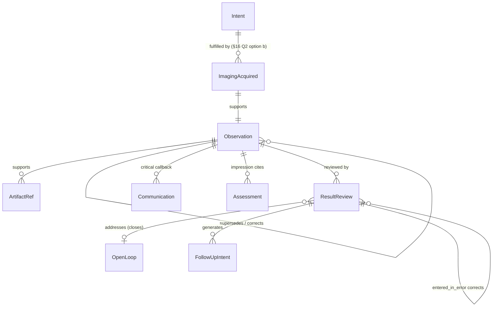

# A2. Results review (imaging / tests / procedures)

## 1. Clinical purpose

A diagnostic result is the moment a study (CT, MRI, echo, EKG, bronchoscopy, pathology specimen, POCUS) is transformed into a statement about the patient that another clinician will act on. Unlike a numeric lab, the statement is **narrative-dominant** — a prose Impression plus Findings — and is anchored to a **native artifact** (DICOM study, waveform, PDF report). The clinical purpose of a results-review module is therefore two-sided: (a) represent the narrative result and its artifact so downstream reasoning can cite, supersede, and react to it; and (b) record the act of a treating clinician having **transferred the result from "available in the chart" to "integrated into the active cognitive model of the care team"**, thereby closing the safety loop opened when the test was ordered. That acknowledgment — not the existence of the result — is what closes loops. The same review primitive that closes a critical potassium in A1 must close a saturating PE on CT in A2, or the substrate has failed calibration.

## 2. Agent-native transposition

A results-review module in a legacy EHR is a radiology inbox, a pathology queue, a co-sign tray, and a free-text acknowledgment stamp. In pi-chart it decomposes into four orthogonal primitives sharing a common grammar:

| Legacy artifact | Pi-chart primitive | Supporting views |
|---|---|---|
| Radiology / path / procedure report (prose) | `observation` with narrative payload (`findings`, `impression`, `result_domain`, `modality`, `status_detail`) | `timeline()`, `evidenceFor(problem)` |
| Attached DICOM / PDF / waveform | `artifact_ref` (subtype `imaging` / `ecg` / `scanned_document`), linked from the observation | `render(artifact_ref)`, viewer deep-link |
| Preliminary → final → amended lifecycle | supersession chain via `links.supersedes` / `corrects` | `currentRead(study)`, `timeline(includeSuperseded: true)` |
| "I saw this; here's what I'll do" | **`action.subtype = result_review`** referencing observation(s) and/or artifact_ref(s) | `openLoops()`, `inboxFor(reviewer)`, `evidenceFor(intent)` |
| Critical-finding phone call | `communication` event linked `supports` the observation, required by validator when tier ∈ {1,2} | `criticalCommunicationFor(observation)` |
| Follow-up order driven by finding | `intent` event with `links.addresses` pointing at derived assessment | `activeIntents()`, `fulfillmentOf(intent)` |

The load-bearing claim is that **review is cross-cutting**: `action.result_review` references `observation.lab_result` (A1) OR any A2 narrative diagnostic subtype OR `artifact_ref` with identical link grammar. No branching.

**Coverage threshold — load-bearing anti-cruft discipline.** A `result_review` event MUST NOT be written for every routine nonactionable final result; that recreates an EHR inbox in miniature and would be an A2-specific failure of the charter's "aggressive filtering." Reviews are durable when review *itself* matters: critical findings, clinically significant findings, incidental findings under follow-up, amended/corrected results, policy-required acknowledgments (read-backs for ACR Cat 1/2), and any result that meaningfully changes assessment, intent, or communication. Routine normals remain *implicitly* reviewed unless local policy says otherwise. Whether implicit closure via an `assessment` or `progress_note` citation counts as review is §16 Q5.

*Project owner to rewrite this section per charter §4.4 before Batch 1 calibration passes.*

## 3. Regulatory / professional floor

1. **[regulatory] TJC NPSG.02.03.01** — "Report critical results of tests and diagnostic procedures on a timely basis." Scope explicitly includes diagnostic imaging and pathology. Organization-defined windows, documented receipt timing, escalation. **Quick Safety #52** (2024) frames closed-loop communication as **sent → received → acknowledged → acted upon** — breaking any link is the failure mode. *(Note: TJC Sentinel Event Alert #47 is about radiation risk, NOT test-result communication, contrary to common citation.)*

2. **[regulatory] TJC / NQF Serious Reportable Event #23 (2025 alignment)** — "Failure to follow up or communicate laboratory, pathology, or radiology test results **including incidental findings**" is a reportable event. Expands the review primitive's scope beyond panic values to incidental findings under follow-up; anchors `recommendation_status`, OL-RESULT-06 `recommendation_unwritten`, and OL-RESULT-07 `patient_notification_pending` (§11, §14c).

3. **[regulatory] CMS 42 CFR 482.26** (Radiologic Services) — interpretations signed by reading physician; reports and images retained ≥5 years. **§482.53** parallels for nuclear medicine. **§482.24(c)(1)** — entries complete, dated, timed, authenticated. **§482.24(c)(4)(vi)** — radiology and laboratory reports in medical record.

4. **[professional] ACR Practice Parameter for Communication of Diagnostic Imaging Findings (2020 rev.)** — documentation of *time*, *person receiving*, *issue communicated*; EHR posting alone does not satisfy duty for urgent findings. **Larson et al., *JACR* 2014** (Actionable Reporting Work Group): **Category 1 minutes, Category 2 hours, Category 3 days**. Drives OL-RESULT-01 SLA windows.

5. **[professional] CAP accreditation** — **COM.30100** (read-back confirmation for critical results; anchors `acknowledgment_method`); **ANP.12185** (amended anatomic-pathology report must state reason, retain original, notify responsible clinician; drives supersession + OL-RESULT-03). Plus **SCCM / ASE-ACEP-CHEST POCUS consensus (2024)** recognizing bedside intensivist reading and documenting POCUS without separate radiologist read — substrate must allow reader = treating clinician.

## 4. Clinical function

The review layer operates at **four cadences** in the ICU:

- **Critical escalation (minutes).** Acknowledgment of ACR Cat 1/2 imaging, critical lab, positive frozen section. Almost always paired with a `communication` event (read-back) and a corrective `intent`. Closes OL-RESULT-01 immediately.
- **Scheduled / batch trending (hours).** AM pre-rounds: **one** review action links to 15+ targeted observations (morning BMP/CBC/Mg + portable CXR on vented patients). Treats the batch as a coherent cognitive act. See §14c `reviewed_as_batch`.
- **Event-driven confirmation (shift-level).** Post-repletion recheck, post-vent-change ABG, pathology finalizing malignancy, microbiology ladder (Gram stain → speciation → susceptibilities). Output: changed assessment or new follow-up intent.
- **Incidental / cross-setting (days).** Pulmonary nodule on trauma CT, thyroid lesion on CTA, send-out test after transfer, pathology after discharge. Output: follow-up plan, PCP/patient communication, discharge instruction update. SRE 23 scope.

Per-consumer specifics. **ICU attending** reads overnight portable CXR, interval CTs, pending final reads; consumes Impression first, Findings if ambiguous. **Overnight resident/APP** acts on preliminary reads before attending cosign; prelim-vs-final discrepancy → OL-RES-05 + OL-RESULT-03. **Intensivist performing POCUS** interprets at bedside; reader = treating clinician. **Proceduralist** reads post-line CXR before committing to line use; the review gates line usability in A5. **Consulting pathologist** amends permanent against prior frozen; high-consequence event per CAP ANP.12185. **Radiologist making Cat 1 finding** phone-calls ordering/covering provider; the `communication` + `result_review` pair constitutes loop closure.

Handoff question: "Any unreviewed criticals, amended results, preliminary-final discrepancies, or pending recommendations since last review?" — answered by `openLoops()`.

## 5. Who documents

**Reading physician** (radiologist, pathologist, cardiologist, proceduralist) authors the narrative observation; owns report content. **Technologist** generates acquisition metadata (mostly cruft; §8). **AI triage** may attach preliminary classification as its own observation with `reader.role = ai_triage`, superseded by human read. **Treating clinician** (intensivist, resident, APP) authors `action.result_review` and any downstream `intent`. **RN/RT** author reviews for protocolized acknowledgments (critical glucose on insulin drip, ABG post-vent-change). **pi-agent** may author provisional reviews for non-critical trending results under a human-confirmation discipline (§16 Q6).

**Ownership of record is split**: reading physician owns the read; treating team owns acknowledgment and response. This split survives unchanged from A1.

## 6. When / how often

Event-driven on **report finalization**, **amendment**, and **significant-result arrival**, with a **periodic rounds overlay**. SLA windows the substrate must respect:

- ACR Cat 1: communication + review within **minutes**
- ACR Cat 2: within **hours**
- ACR Cat 3 / incidental under follow-up: within **days** (SRE 23 scope)
- Resident preliminary → attending cosign: site-defined, typically 8–24 h
- Pathology turnaround: frozen ~20 min, routine 1–3 d, molecular days–weeks
- Portable CXR in vented ICU: de facto stale > 24 h for tube-position; clinical-status changes reset staleness

Each is an SLA that feeds openLoop generation (§11), not a field on the event. **For a review action**, `effective_at` and `recorded_at` are typically simultaneous; divergence signals back-charting.

## 7. Candidate data elements

Two tables because the event types are genuinely different primitives.

### 7a. Narrative diagnostic observation

Applies to `observation.diagnostic_result` (recommended consolidation; §16 Q1) or per-modality subtypes.

| Field | Tags | What fails if absent | Sourceability |
|---|---|---|---|
| `data.result_domain` ∈ {imaging, ecg, echo, endoscopy, pathology, procedure, pocus, other} | [clinical][agent] | Cannot route domain-specific review SLA or artifact expectations; CT PE and path amendment look identical | pi-sim, manual_scenario, FHIR `DiagnosticReport.category` |
| `data.modality` (CT/MRI/XR/US/NM/EKG/echo/endoscopy/path/procedure) | [clinical][agent] | Cannot apply modality-specific staleness; `timeline(modality=…)` broken | MIMIC-IV `radiology_detail.field_name='exam_name'`; DICOM (0008,0060); FHIR `modality` |
| `data.study_code` (LOINC / RSNA Playbook RPID) | [regulatory][agent] | No stable join for serial comparison; ordering intent cannot reconcile to performed study | LOINC/RSNA Playbook; FHIR `DiagnosticReport.code`; MIMIC CPT rows |
| `data.accession` / `data.study_uid` | [regulatory] | Cannot reach DICOM; retention violated | DICOM (0020,000D); FHIR `ImagingStudy.identifier` |
| `data.study_description` | [clinical] | Human/agent cannot distinguish "CT head" from "CT PE" without code lookup | Synthea, pi-sim, manual_scenario |
| `data.performed_at` / `data.reported_at` / `data.cosigned_at` | [regulatory][agent] | SLA clocks cannot start; §16 Q3 `effective_at` semantics collapse | FHIR `effective[x]` + `issued`; MIMIC `charttime` / `storetime` |
| `data.status_detail` ∈ {preliminary, final, amended, corrected, addendum} | [regulatory][clinical] | Cannot detect cosign gap, prelim-final discrepancy, or amended results requiring re-review | FHIR `DiagnosticReport.status`; MIMIC `parent_note_id` structure |
| `data.impression` | [clinical][agent] | Impression-driven problem-list linkage fails; agent summarization broken | MIMIC radiology text; FHIR `DiagnosticReport.conclusion` |
| `data.findings` (long narrative) | [clinical] | Ambiguous impressions unauditable; pathology/procedure detail lost | MIMIC radiology text; FHIR `DiagnosticReport.presentedForm` |
| `data.conclusion_codes` (SNOMED / RadLex RIDs) | [agent][open-schema] | Derived views lose queryable impression; `evidenceFor(problem)` matching fails | FHIR `conclusionCode`; DICOM SR CODE; RadLex |
| `data.reader` (id + role) | [regulatory] | CoP §482.26 signed-interpretation requirement unmet; cosign routing broken | FHIR `resultsInterpreter` |
| `data.actionability_tier` ∈ {1, 2, 3, incidental, none} | [regulatory][agent] | Cannot fire OL-RESULT-01/04/06; V-RES-02 unenforceable | ACR reporting tools; derivable from text for MIMIC |
| `data.recommendation` (text + follow-up window, if present) | [clinical][agent] | Incidental-finding follow-up lost; OL-RESULT-06 cannot fire | Narrative parse (dictation) |
| `data.comparison_prior_ids` | [clinical][agent] | `trend(serial_cxr)` impossible; "unchanged from prior" unverifiable | Narrative "COMPARISON" section |
| `data.body_site` / `data.laterality` | [clinical] | Cannot disambiguate serial imaging (L vs R chest tube) | FHIR `bodySite` / `laterality`; RadLex |
| `data.reason_for_amendment` (if `status_detail ∈ {amended, corrected, addendum}`) | [regulatory] | CAP ANP.12185 violated; re-review cannot justify itself | FHIR note at amendment |
| `links.supports → artifact_ref` | [clinical] | Cannot open viewer; retention of images decoupled | pi-chart internal |

### 7b. Cross-cutting `action.result_review` — the central contribution

| Field | Tags | What fails if absent | Sourceability |
|---|---|---|---|
| `data.references` (observation or artifact_ref event_ids) | [agent] | Loop closure undefined; OL-*-01 cannot resolve | pi-sim, manual_scenario |
| `data.reviewer` (id + role) | [regulatory] | Attribution lost; TJC documentation unmet | pi-sim |
| `data.reviewed_at` | [regulatory][agent] | SLA compliance (TJC EP 3) unmeasurable | pi-sim |
| `data.significance` ∈ {routine, significant, critical, incidental_significant} | [clinical][agent] | Cannot distinguish batch clear from critical-action review; SRE 23 scope collapses | pi-sim |
| `data.disposition` ∈ {no_action_needed, already_addressed, follow_up_written, repeat_test_ordered, escalated, deferred_pending, patient_notification_only} | [clinical][agent] | Review degenerates to read-receipt; no durable answer to what was decided | pi-sim |
| `data.rationale_text` (required when `disposition ∈ {no_action_needed, already_addressed, deferred_pending}` OR `recommendation_status ∈ {declined, deferred}`) | [clinical] | "No action" becomes unauditable | pi-sim |
| `data.recommendation_status` ∈ {not_applicable, accepted, declined, deferred} | [regulatory][clinical] | Incidental-finding follow-up untrackable; OL-RESULT-06 cannot fire; SRE 23 scope unmet | pi-sim |
| `data.acknowledgment_method` ∈ {electronic_read, verbal_readback, protocol_standing_order, implicit_via_citation} | [regulatory] | CAP COM.30100 read-back path not auditable | pi-sim, `communication` event |
| `data.reviewed_as_batch` (bool) | [clinical] | Cannot distinguish single-target from multi-target review; audit granularity lost | pi-sim |
| `data.critical_flag_at_review` (bool, snapshot) | [regulatory][agent] | If linked result's critical flag later changes via amendment, compliance record becomes ambiguous | derived from A1 at write time |
| `data.communication_event_id` (if Cat 1/2) | [regulatory] | Cat 1/2 finding has no closed-loop witness | pi-sim |
| `links.supports → observation / artifact_ref` | [agent] | Graph disconnected | pi-sim |
| `links.addresses → openLoop / assessment` | [agent] | OL-*-01 remains open after review | pi-sim |
| `links.fulfills → review-required intent` (not order intent; V-RES-12) | [agent][open-schema] | Only under explicit review-obligation-intent model | pi-sim |
| `status` ∈ {draft, final, entered_in_error, superseded} | [clinical] | Mistaken/wrong-patient reviews cannot be struck | pi-sim |

**Note:** `batch_count` is NOT a stored field — it is derived from `references.length` and storing it invites inconsistency. Sourceability note: MIMIC-IV has essentially no review-action data, which is itself a strong signal that `result_review` is a genuinely agent-native primitive rather than a digitized legacy form.

## 8. Excluded cruft

| Excluded element | Why it exists in EHRs | Why cut |
|---|---|---|
| **`is_reviewed` boolean on the observation row** | Relational simplicity: mutate row instead of appending event | Violates append-only invariant; destroys analytical/accountability split; breaks batch review |
| **Inbox folder / queue name / read-unread badge** | Worklist routing and visual triage | Rendered state, not canonical evidence |
| **`batch_count` stored on the review** | Summary display for bulk review | Derived from `references.length` — storing risks inconsistency |
| **Generic result priority copied from the order** | Inbox sorting | Review urgency is derived from `actionability_tier` + clinical context; order priority is stale and often wrong |
| **"Time in inbox" / turnaround metric on the event** | Departmental QA dashboards | Derived — compute from `resulted_at` vs `reviewed_at`, never store |
| **Forward-to / CC / distribution list** | Email-like routing | If the callback matters, it's a `communication` event; overloading review action with routing is wrong |
| **"Seen by" list per result** | Defensive multi-user audit | Each review is an authored action; multiple reviews = multiple events |
| **Printed-report header/footer blocks (logo, disclaimer)** | Paper-era fax workflow | Zero information for reasoning |
| **Transcriptionist ID / dictation audio URL** | Medico-legal transcription audit | Reading physician signs and owns |
| **DICOM header minutiae: series count, slice count, kVp/mAs, dose_DLP** | Technologist QA | Not clinically consumed at review time; dose (if tracked) belongs on separate `observation.radiation_dose` |
| **Billing modifiers (26/TC split, G-codes, RVU complexity)** | Revenue cycle | Out of scope |
| **Template version / report template ID, font/formatting markup** | Vendor QA, WYSIWYG dictation | Does not change meaning; lost in plain payload |
| **Repeated patient identifiers per section, "verified by Dr. X on [datetime]" trailer** | Paper-era collation | Envelope carries identity once; attribution already in `reader` + `finalized_at` |

## 9. Canonical / derived / rendered

**Canonical events:** `observation` (narrative diagnostic result), `artifact_ref` (native DICOM/PDF/waveform), `action.result_review`, `communication` (Cat 1/2 callbacks), `assessment` (problem created/updated from impression), `intent` (follow-up). Amendments are **new events** with `links.supersedes` / `corrects`; the prior remains retrievable (CMS + CAP).

**Derived views** (queries, never stored as truth):
- `inboxFor(reviewer)` — observations not yet referenced by any `result_review` by that reviewer, filtered by policy coverage threshold.
- `timeline(modality=CT)`, `trend(serial_cxr)` — chronology and serial comparison.
- `evidenceFor(problem=PE)` — active problem → assessment → citing observation → artifact_ref.
- `openLoops()` — the OL-RESULT-* set from validators + SLAs (§11).
- `currentRead(study_uid)` — tip of the supersession chain for a single accession.
- "Time to review" metrics for any linked critical.

**Rendered (never canonical):** collapse of Findings under Impression, DICOM viewer deep-link, read/unread badge, color flag by `actionability_tier`, "amended" banner, inbox-counter badge, green-checkmark on reviewed items.

## 10. Provenance and lifecycle

`source.kind` values: `imaging_interface_hl7`, `dictation_system`, `pacs_interface`, `pathology_lis`, `cardiology_reporting`, `endoscopy_reporting`, `clinician_chart_action` (review via UI), `agent_review` (review by pi-agent), `protocol_standing_order` (RN/RT protocol-driven), `pi-sim`, `manual_scenario`.

**Lifecycle (narrative observation).** Created at report finalization (or at preliminary sign when status_detail=prelim). Never updated in place: every amendment, correction, addendum, or final-supersedes-preliminary produces a **new event** carrying `links.supersedes` (soft replacement, including prelim→final) or `links.corrects` (hard correction). Addendum may use a new event with `status_detail = addendum`. Original retained. A review performed against a superseded read **reopens** automatically (§11, OL-RESULT-03).

**Lifecycle (review action).** Also never updated in place. A mistaken review (wrong patient, wrong target, accidental batch-clear) is corrected by appending a **new review action** with `status = entered_in_error` + `links.corrects → prior_review_event_id` + non-empty `rationale_text` (V-RES-10). The erroneous review remains as historical evidence, no longer closing any loop.

**Fulfills — §16 Q2 (substrate-wide) resolution proposed.** A1 flagged that `observation → intent` fulfillment violates the CLAIM-TYPES.md convention (`fulfills` is `action → intent`). A2 makes the cleaner path visible: the study/procedure **is an action**. Proposed intermediate actions that fulfill the originating intent:
- `action.subtype = imaging_acquired` — technologist/device completes the study
- `action.subtype = procedure_performed` — proceduralist completes bronchoscopy, LP, line placement
- `action.subtype = specimen_collected` — generalizes A1's specimen collection

The narrative observation then `supports` the acquisition action rather than fulfilling the intent directly. **Invariant 10 stays intact.** This is structurally cleaner than A1 could offer alone, because procedures/studies inherently contain an acquisition action, whereas for a chem-7 the intermediate feels inserted. **Recommendation: adopt substrate-wide.** All three council members independently converged on this resolution.

**Staleness.** Modality-dependent. Portable CXR in vented ICU stale > 24 h for tube/line verification; > 6–12 h if respiratory status changes. CT PE stale within hours if hemodynamics change. Pathology final stale per standard-of-care follow-up. **Staleness alone generates nothing** (§11).

### Contradictions and reconciliation

| Conflict | Pi-chart response |
|---|---|
| Preliminary "no bleed" → final "small SDH" | `supersedes` final over prelim; `preserve both`; `require review` of final because prior care may have rested on the preliminary |
| POCUS impression conflicts with formal echo | `preserve both` + `warn`; reconciliation belongs in an `assessment`, not destructive overwrite |
| Review "no action" on a Cat 1/2 finding | `preserve both` + `warn`; require rationale or follow-up intent to close OL-RESULT-04 |
| Duplicate report for same accession | `warn`; `supersede` only if source marks replacement; else preserve as import duplicate |
| Pathology amendment reverses benign/malignant call | `corrects` + preserve original + `require review`; downstream plans may be invalid |
| Two clinicians review same result with different dispositions | `preserve both` + `warn`; downstream intent and communication reveal which path advanced |

Chart-as-claims, not chart-as-truth.

## 11. Missingness / staleness → openLoops

Carry forward A1's reframe: **staleness alone does not create an openLoop; missing expected evidence against an active intent does.** For A2 the parallel rule: **missing review alone does not create an openLoop; missing review *of a significant, critical, amended, or recommendation-bearing result* does.** Obligation arises from significance, amendment, recommendation, or policy — not from mere existence. Direct consequence of the coverage threshold (§2).

Proposed openLoop kinds. **Unified with A1 as `OL-RESULT-*`** (generating logic is identical). `OL-RES-05` is A2-specific (no A1 analog; labs have no prelim/final gap).

- **OL-RESULT-01 `critical_unreviewed`** — observation with `actionability_tier ∈ {1, 2}` (or A1 critical flag) without a matching `result_review` within tier window. Closes on review with `disposition ≠ deferred_pending`.
- **OL-RESULT-02 `order_unresulted`** — active `intent` for a study/test with no matching observation (and no intermediate `imaging_acquired` / `procedure_performed` / `specimen_collected` action) within modality SLA.
- **OL-RESULT-03 `amended_post_review`** — an observation amended/corrected/addended after a prior `result_review` existed OR after a prior `assessment` cited it. Reopens review. Matches CLIA §493.1291(k) and CAP ANP.12185.
- **OL-RESULT-04 `actionable_unaddressed`** — significant/critical finding reviewed with `disposition ∈ {follow_up_written, escalated, repeat_test_ordered}` but no corresponding `intent` or `communication` within tier window. A review with `disposition = no_action_needed` + non-empty `rationale_text` does NOT fire this (explicit deferral is a closed loop).
- **OL-RES-05 `preliminary_uncosigned`** (A2-specific) — preliminary observation without final supersession within cosign SLA.
- **OL-RESULT-06 `recommendation_unwritten`** — review records `recommendation_status = accepted` (or disposition implies follow-up: incidental nodule → follow-up CT) but no downstream `intent` appears within the recommendation's follow-up window. SRE 23 scope. Closes via follow-up intent.
- **OL-RESULT-07 `patient_notification_pending`** — review `disposition = patient_notification_only` or `recommendation` requires patient/family/PCP communication, but no matching `communication` event by due window. SRE 23 scope. Closes via communication event. Kept distinct from OL-RESULT-06 because the two close via different primitives (intent vs communication) and SRE 23 explicitly names both scopes.

## 12. Agent read-before-write context

Before writing a new diagnostic **observation**:
- `priorStudies(patient, modality)` — comparison context.
- `activeProblems(patient)` — frames impression and coding.
- `orderingIntent(accession)` — verify read matches clinical question.
- `timeline(types: ["action"], subtypes: ["imaging_acquired", "procedure_performed", "specimen_collected"], from: T-72h)` — acquisition action the observation should support.

Before writing an **`action.result_review`**:
- `get(reference_id)` — the observation(s) and linked `artifact_ref`.
- `priorReviewsOf(reference_id)` — detect prior reviews, amendment chains.
- `openLoopsReferencing(reference_id)` — which loop(s) the review should `addresses`.
- `evidenceChain(event_id)` — prior assessments/intents resting on this result; critical before writing a correction that invalidates them.
- `activeIntents(patient)` — avoid duplicate follow-up orders.
- `activeProblems(patient)` — downstream intents cite the right assessment.
- `readActiveConstraints()` — allergies, code status, renal/contrast, bleeding risk; changes what "appropriate action" means.
- `narrative(from: T-24h, subtypes: [progress_note, handoff, phone_note])` — recent human reasoning and callback context.
- `trend(metric: <related>, window: <clinical>)` — when result only interpretable against trajectory (troponin, lactate, creatinine).

Before writing a **downstream `intent` or critical `communication`**:
- Target result(s), the review action, active problems, active intents, constraints — so the agent does not duplicate orders or violate safety context.
- For communication: `onCallFor(patient, role=ordering)`, `recentCommunicationsFor(patient)` to avoid duplicate pages.

"Read the chart" is insufficient. The agent calls specific views.

## 13. Related artifacts

A1 (labs) — the **same** `action.result_review` primitive closes lab and non-lab loops; this is the calibration claim. A3 (vitals) — acute decompensation prompts emergent imaging and POCUS; vitals trend is comparison context. A4 (MAR) — contrast-medication reconciliation pre-CT, anticoagulation-hold pre-procedure, antibiotic narrowing on susceptibilities. A5 (LDAs) — **tight coupling**: line placement → procedure action → post-placement CXR observation → `result_review` gates line usability. A6 (notes) — provider notes cite imaging impression via `links.supports`; a note citation may (per §16 Q5) constitute implicit review. A7/A8 (nursing) — the nurse may be the `communication` receiver for a critical finding called to the bedside. A9a (orders) — originating `intent` whose fulfillment is discussed in §10.

## 14. Proposed pi-chart slot shape

**No new top-level event types.** Subtype work on existing `observation`, `artifact_ref`, `action`, `communication`, `intent`, `assessment`.

### 14a. Narrative diagnostic observation (consolidated `diagnostic_result` recommended; §16 Q1)

```jsonc
{
  "id": "evt_20260420T0648_01",
  "type": "observation",
  "subtype": "diagnostic_result",
  "subject": "patient_001",
  "encounter_id": "enc_001",
  "effective_at": "2026-04-20T06:12:00-05:00",   // = performed_at; §16 Q3
  "recorded_at":  "2026-04-20T06:48:00-05:00",   // = reported_at / finalized_at
  "author": { "id": "rad_att_01", "role": "radiologist" },
  "source": { "kind": "pacs_interface", "ref": "accession:A20260420-77" },
  "status": "final",
  "data": {
    "result_domain": "imaging",
    "modality": "CT",
    "study_code": { "system": "loinc-rsna-playbook", "code": "placeholder" },
    "study_description": "CT pulmonary angiogram",
    "accession": "A20260420-77",
    "study_uid": "1.2.840.example.77",
    "performed_at":   "2026-04-20T06:12:00-05:00",
    "reported_at":    "2026-04-20T06:48:00-05:00",
    "cosigned_at":    null,
    "status_detail":  "final",
    "impression":     "Acute bilateral pulmonary emboli without CT evidence of right heart strain.",
    "findings":       "Filling defects in bilateral segmental pulmonary arteries. No pleural effusion.",
    "conclusion_codes": [ { "system": "snomed", "code": "59282003", "display": "Pulmonary embolism" } ],
    "reader":             { "id": "rad_att_01", "role": "attending_radiologist" },
    "actionability_tier": 2,
    "recommendation":     null,
    "comparison_prior_ids": ["evt_20260418T0700_cxr"],
    "body_site": "chest", "laterality": null,
    "reason_for_amendment": null
  },
  "links": {
    "supports":  ["evt_20260420T0612_acq_01", "evt_20260420T0612_artifact_01"],
    "supersedes": [], "corrects": [], "fulfills": [], "addresses": []
  }
}
```

### 14b. Native file artifact_ref

```jsonc
{
  "id": "evt_20260420T0612_artifact_01",
  "type": "artifact_ref",
  "subtype": "imaging",          // or ecg / waveform / scanned_document
  "subject": "patient_001", "encounter_id": "enc_001",
  "effective_at": "2026-04-20T06:12:00-05:00",
  "recorded_at":  "2026-04-20T06:13:00-05:00",
  "source": { "kind": "pacs_interface", "ref": "study_uid:1.2.840.example.77" },
  "status": "final",
  "data": {
    "kind": "imaging",
    "path": "artifacts/imaging/2026-04-20_ctpe.dcm",
    "mime": "application/dicom",
    "bytes": 412558229,
    "description": "CT pulmonary angiogram native study"
  }
}
```

### 14c. Cross-cutting review action — the central contribution

```jsonc
{
  "id": "evt_20260420T0655_review_01",
  "type": "action",
  "subtype": "result_review",
  "subject": "patient_001", "encounter_id": "enc_001",
  "effective_at": "2026-04-20T06:55:00-05:00",
  "recorded_at":  "2026-04-20T06:55:08-05:00",    // simultaneous with effective_at for reviews
  "author": { "id": "icu_resident_01", "role": "resident" },
  "source": { "kind": "clinician_chart_action" },
  "status": "final",
  "data": {
    "references": ["evt_20260420T0648_01"],        // 1..N observations / artifact_refs; mixed modalities permitted
    "reviewer":   { "id": "icu_resident_01", "role": "resident" },
    "reviewed_at":"2026-04-20T06:55:00-05:00",
    "significance": "critical",                    // routine | significant | critical | incidental_significant
    "disposition":  "follow_up_written",           // see §7b enum
    "recommendation_status": "not_applicable",     // not_applicable | accepted | declined | deferred
    "acknowledgment_method": "verbal_readback",    // electronic_read | verbal_readback | protocol_standing_order | implicit_via_citation
    "reviewed_as_batch": false,
    "critical_flag_at_review": true,               // snapshot; matters if flag later changes via amendment
    "rationale_text": null,                        // required when disposition ∈ {no_action_needed, already_addressed, deferred_pending}
    "communication_event_id": "evt_20260420T0654_comm_01"
  },
  "links": {
    "supports":  ["evt_20260420T0648_01"],
    "addresses": ["ol_result_01_9c21"],            // the critical_unreviewed loop being closed
    "supersedes": [], "corrects": [], "fulfills": []
  }
}
```

### 14d. ER diagram



**Link conventions.** `supports` (required, from review → reviewed result/artifact; from observation → acquisition action and artifact_ref); `supersedes` (soft prelim→final or amendment); `corrects` (hard correction, triggers OL-RESULT-03); `addresses` (review → openLoop / problem assessment). **`fulfills` is NOT used by `result_review`** — reserved for action→intent; diagnostic acquisition/performance actions fulfill upstream orders (§16 Q2 resolution).

**Evidence addressability.** event_id for observation and review action; artifact event_id for native files; `references` array for batch reviews; `interval ref` when the review covers a time-bounded numeric trend.

**Storage placement.** `events.ndjson` for all three primitives; native files under `artifacts/`. No new storage pattern.

**Frequency class.** Event-driven with periodic batch-review overlay.

**View consumers.** `timeline`, `evidenceChain`, `openLoops`, `narrative`, `currentState(axis: "intents")`; `trend` when the review target is numeric.

**Schema confidence & impact.** Narrative observation `diagnostic_result` subtype: medium confidence, medium impact (new subtype + new payload shape). Artifact_ref subtypes: high confidence, low impact (exist). `action.result_review`: **medium-high confidence, medium impact, HIGH LEVERAGE** — new subtype with novel payload, defines closed-loop semantics across A1 and A2. Batch-review support is first-class, not edge-case.

## 15. Validator and fixture implications

Proposed validator rules (cross-reference V-LAB-* from A1 where parallel):

- **V-RES-01.** `observation.subtype = diagnostic_result` (or per-modality) requires non-empty `data.result_domain`, `data.modality`, `data.study_description`, `data.performed_at`, `data.reported_at`, `data.status_detail`, `data.impression`, and `data.reader` when `status_detail = final`. Warn if image-producing modalities lack an artifact_ref link.
- **V-RES-02.** Any observation with `actionability_tier ∈ {1, 2}` requires a linked `communication` event within tier window OR fires `OL-RESULT-01`. Tier 3 / incidental follows OL-RESULT-06.
- **V-RES-03.** `action.result_review.data.references` MUST be non-empty; each referent MUST resolve to `observation` OR `artifact_ref` on the same patient. **Review targets MUST NOT be `intent` events** (intents are fulfilled, not reviewed). `reviewer.role` must be in the authorized set (treating clinician, consultant, attending, protocol-authorized RN/RT; not transcriptionist, not technologist).
- **V-RES-04.** Amendments MUST carry `links.supersedes` (replacement) or `links.corrects` (correction) AND non-empty `data.reason_for_amendment` (CAP ANP.12185). Parallels V-LAB-06.
- **V-RES-05.** Preliminary observations MUST be superseded by a final within cosign SLA or fire `OL-RES-05`.
- **V-RES-06 (cross-cutting with A1).** `action.result_review.links.supports` may target `observation.lab_result` (A1) OR any A2 narrative diagnostic observation OR `artifact_ref`. Single rule, no domain branching.
- **V-RES-07 (§16 Q2 placeholder).** Until Q2 resolves, `observation.links.fulfills` is a **warning**; once Q2 resolves in favor of the intermediate-action model, it becomes a **hard reject**. Preferred path: `intent ← imaging_acquired / procedure_performed / specimen_collected ← observation (supports)`.
- **V-RES-08.** If `data.disposition ∈ {follow_up_written, repeat_test_ordered, escalated, patient_notification_only}`, a corresponding downstream `intent` OR `communication` event must exist within org-defined window OR the matching openLoop (OL-RESULT-04/06/07) must be open.
- **V-RES-09.** If `data.disposition ∈ {no_action_needed, already_addressed, deferred_pending}` OR `data.recommendation_status ∈ {declined, deferred}`, `data.rationale_text` must be non-empty. Prevents silent no-action closure.
- **V-RES-10.** `status = entered_in_error` on a result_review requires non-empty `links.corrects` + non-empty `rationale_text`. Wrong-patient corrections and accidental batch-clears must be auditable.
- **V-RES-11.** If `data.reviewed_as_batch = true`, `data.references.length ≥ 2`. (`batch_count` is derived, not stored.)
- **V-RES-12.** If `links.fulfills` is present on a review action, every target MUST be an `intent` representing a *review-required* or *follow-up-required* obligation, NOT the original diagnostic order intent. The order is fulfilled by the intermediate acquisition action per §10.

**Fixture set (septic-shock MICU, 8 scenarios).**

1. **Routine portable CXR, batch-reviewed.** `intent(cxr_portable) → imaging_acquired → observation(diagnostic_result, result_domain=imaging, impression="stable tube/line position, unchanged bibasilar opacities", actionability_tier=none, status_detail=final) ← artifact_ref(DICOM)`. At rounds, **one** `result_review(significance=routine, disposition=no_action_needed, reviewed_as_batch=true, rationale_text="AM labs + CXR all within expected trajectory")` closes 5 observations (3 labs from A1 + 2 imaging) at once. Exercises V-RES-01, V-RES-03, V-RES-07, V-RES-09, V-RES-11.
2. **CT PE positive, saturating.** ACR Cat 2. Final read triggers radiologist phone call → `communication` event → ICU resident `result_review(significance=critical, disposition=follow_up_written, acknowledgment_method=verbal_readback)` with linked heparin `intent`. Exercises V-RES-02, closes OL-RESULT-01.
3. **Preliminary → final supersession with discrepancy.** Resident prelim CT head "no acute intracranial findings" reviewed (disposition=no_action_needed + rationale) at 02:00. Attending final at 07:30 "small left frontal SDH." Final observation carries `links.supersedes`. `OL-RESULT-03` fires (amended_post_review); new `result_review` on the final. Exercises V-RES-04, V-RES-05.
4. **Bedside POCUS by intensivist.** `observation(diagnostic_result, result_domain=pocus, reader.role=icu_attending, status_detail=final)` authored directly by treating clinician. Auto-generated `result_review(reviewer = author, disposition=actioned, acknowledgment_method=electronic_read)` addressing the shock-characterization assessment. Exercises SCCM anchor and the no-separate-reader case.
5. **Central line placement + post-line CXR (A2 ↔ A5 coupling).** `intent(central_line) → action.procedure_performed(central_line) ← observation(diagnostic_result, result_domain=procedure) + artifact_ref(procedure_pdf)`; separate `intent(post_line_cxr) → imaging_acquired → observation(diagnostic_result, result_domain=imaging, impression="tip at cavoatrial junction, no pneumothorax")`; `result_review` on the CXR gates LDA "line usable" status in A5. Exercises §16 Q2 option (b) cleanly.
6. **Amended surgical pathology.** Final "benign reactive lymph node" at day 3; amended "follicular lymphoma" at day 8 with `reason_for_amendment="additional IHC stains revealed aberrant CD10"`, `links.corrects` on prior. Fires OL-RESULT-03; prior `result_review` becomes non-closing; treating team's new review (disposition=follow_up_written) generates oncology consult intent. Exercises V-RES-04, V-RES-10 semantics, CAP ANP.12185.
7. **Incidental pulmonary nodule on trauma CT.** Final CT abdomen/pelvis incidentally reveals 8mm RLL nodule; `recommendation="follow-up chest CT in 3 months per Fleischner"`; `actionability_tier=incidental`. Review with `significance=incidental_significant, disposition=follow_up_written, recommendation_status=accepted`; downstream `intent(follow_up_ct, due_in=90d)` + `communication(pcp, handoff)`. If the follow-up intent is missing within policy window, `OL-RESULT-06 recommendation_unwritten` fires; if no patient notification communication, `OL-RESULT-07 patient_notification_pending` fires. Exercises SRE 23 scope, V-RES-08, both new openLoops.
8. **Wrong-patient batch-clear correction.** Attending accidentally batch-clears another patient's AM labs through a UI selection error. A follow-up review with `status=entered_in_error, links.corrects → prior_review_event_id, rationale_text="batch review accidentally applied to wrong patient via inbox filter"` strikes the erroneous review; the original labs re-enter `OL-RESULT-01` open state. Exercises V-RES-10 and the error-correction path.

## 16. Open schema questions

Priority-ordered; feed OPEN-SCHEMA-QUESTIONS.md.

1. **Consolidated `diagnostic_result` subtype vs per-modality subtypes.** (A) single `observation.diagnostic_result` with `result_domain` + `modality` in payload (minimizes entropy, unifies queries); (B) discrete `imaging_result` / `procedure_report` / `pathology_result` / `cardiology_result` (admits modality-specific constraints). **Convergent council recommendation: (A) consolidated with payload polymorphism.** Parallels A1's pressure toward `observation.lab_result` as single subtype.

2. **Does A2 resolve A1's Q1 (fulfillment semantics) via the intermediate-action model?** `action.imaging_acquired` / `procedure_performed` / `specimen_collected` fulfills the intent; the narrative observation `supports` the action. Natural for A2 because the study is inherently an action; generalizes cleanly to A1. **Convergent council recommendation: adopt substrate-wide.** Once adopted, V-RES-07 and V-LAB-01 become hard rejects rather than warnings.

3. **`effective_at` semantics** (carried forward from A1 Q2). For diagnostic observation: `performed_at` vs `reported_at` vs `cosigned_at`. For review action: `reviewed_at` (which is also `recorded_at`, typically). Consistent resolution across A1/A2.

4. **Coverage threshold — when MUST a review action exist?** Only for significant / critical / amended / incidental / recommendation-bearing / policy-flagged results, or for all reviewed results? Former matches §2's anti-cruft discipline; latter gives exhaustive audit trail at inbox-mimicry cost. **Recommendation: policy-significant only; routine nonactionable results remain implicitly reviewed unless local policy says otherwise.** Anchored to SRE 23 significant-result scope.

5. **Implicit closure via note/assessment citation.** If an `assessment` or `progress_note` cites a result via `links.supports` — particularly when author = treating team — does that implicitly satisfy the review obligation, or must an explicit `action.result_review` exist? "Click fatigue" vs "silent closure." **Recommendation: allow implicit closure via citation, represented by `acknowledgment_method = implicit_via_citation` on a *derived* review event** — validators can audit derivation rules. Leans toward lower ceremony.

6. **Provisional agent reviews.** May pi-agent author provisional reviews for non-critical trending results that a human later confirms or corrects, or must every review be final at write time? Affects autonomous vs supervised modes. **Recommendation: permit `status = draft` + `source.kind = agent_review` for non-critical only; critical results require human confirmation.**

7. **First-class `actionability_tier` vs derived, unified with A1 Q5.** ACR Cat 1/2/3 + incidental unify with A1's CLSI GP47 `risk_tier` into a single `actionability_tier` payload field on all result observations, with modality-specific policy supplying numeric SLA. If adopted, V-RES-02 and V-LAB-02 collapse to one rule.

## 17. Sources

ACR Practice Parameter for Communication of Diagnostic Imaging Findings (2020 revision), American College of Radiology. Larson PA, Berland LL, Griffith B, Kahn CE Jr, Liebscher LA. "Actionable Findings and the Role of IT Support: Report of the ACR Actionable Reporting Work Group." *J Am Coll Radiol* 2014;11(6):552–558. Berlin L, commentaries on missed findings and closed-loop communication (*JACR*, various). Kadom N, Venkatesh AK, et al. "Novel Quality Measure Set: Closing the Completion Loop on Radiology Follow-up Recommendations for Noncritical Actionable Incidental Findings." *JACR* 2022;19(7):881–890. Lacson R, Prevedello LM, Andriole KP, et al. "Four-year impact of an alert notification system on closed-loop communication of critical test results." *AJR* 2014;203(5):933–938. The Joint Commission, **National Patient Safety Goal NPSG.02.03.01** (current chapters, HAP and LAB programs, eff. Jan 2026), **Quick Safety Issue #52** ("Advancing Safety with Closed-loop Communication of Test Results"), and **2025 NQF Serious Reportable Events alignment — SRE 23** ("Failure to follow up or communicate laboratory, pathology, or radiology test results, including incidental findings"). *(Note: TJC Sentinel Event Alert #47 is about radiation risk, not test-result communication.)* CMS Conditions of Participation **42 CFR 482.26** (Radiologic Services), **482.53** (Nuclear Medicine), **482.24(c)** (Medical Record Services). CAP Accreditation — **Anatomic Pathology Checklist ANP.12185** (amended reports); **All Common Checklist COM.30100** (read-back of critical results); CAP Cancer Protocols. ASE / ACC / AHA echocardiography appropriate-use and reporting standards. DICOM Standard PS3.3 and PS3.16 (Structured Reporting templates, TID 2000 Basic Diagnostic Imaging Report, TID 1500 Measurement Report). HL7 FHIR R5 `DiagnosticReport` and `ImagingStudy` resource specifications. LOINC/RSNA Radiology Playbook (harmonized 2017); RadLex (RSNA). MIMIC-IV-Note v2.2 (`mimiciv_note.radiology`, `radiology_detail`); MIMIC-IV-ECHO and MIMIC-IV-ECG modules (PhysioNet). Frankel HL, Kirkpatrick AW, Elbarbary M, et al. "Guidelines for the Appropriate Use of Bedside General and Cardiac Ultrasonography in the Evaluation of Critically Ill Patients, Parts I–II." *Crit Care Med* 2015;43(11):2479–2502 and 2016;44(6):1206–1227. SCCM Critical Care Ultrasound program materials; 2024 ASE/ACEP/CHEST POCUS nomenclature consensus. Repository: `PHASE-A-CHARTER.md`, `PHASE-A-TEMPLATE.md`, `PHASE-A-EXECUTION.md`, `CLAIM-TYPES.md`, `DESIGN.md`, `README.md` (invariants 1–10); `a1-lab-results.md` (OL-LAB-* parallel structure and Q1 fulfillment question carried forward).
