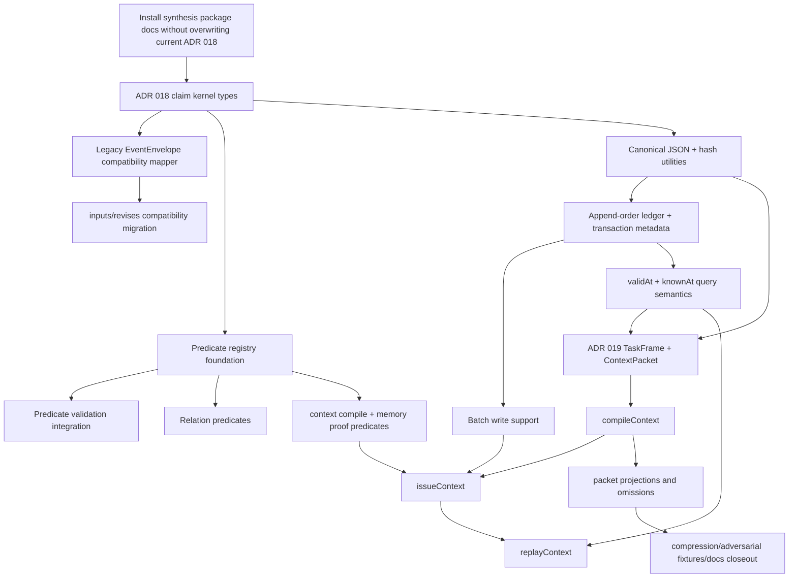

# Implementation Plan: ADR 018 + ADR 019

## 0. Repo State

- Current branch: `main`.
- Git status summary: `main...origin/main [ahead 33, behind 8]`.
- Dirty working-tree files that must not be overwritten:
  - `pi-monitor/crates/monitor-app/src/main.rs`
  - `pi-monitor/crates/monitor-core/src/lib.rs`
  - `pi-monitor/crates/monitor-ui/src/lib.rs`
  - `pi-sim/scripts/public-contract-reader-test.ts`
  - `pi-sim/scripts/runtime/demoWaveformProvider.ts`
  - `pi-sim/scripts/runtime/test.ts`
  - `pi-sim/vitals/README.md`
- Recent repo history inspected: latest commits include `78fcd27 Deepen patient_001 into pi-agent harness fixture`, `333402f Define corpus-readiness evidence before ADR 019`, and `4d161b8 Make architecture rebase durable before clean-slate spike`.
- Packages found:
  - ADR 018 package source: `/home/ark/Downloads/pi-chart-rebase-package.zip`, containing top-level directory `pi-chart-adr-018-package/`.
  - ADR 019 package source: `/home/ark/Downloads/pi-chart-context-engineering-package.zip`, containing top-level directory `pi-chart-adr-019-context-engineering-package/`.
  - Expected literal zip names from the prompt were not found, but the contents match the expected package directories and themes.
- ADR 018/019 install state:
  - `pi-chart/docs/adr/018-architecture-rebase-clinical-truth-substrate.md` already exists and is accepted repo authority. It is a different ADR 018 than the package's `018-kernel-predicate-bitemporal-ledger.md`.
  - No `pi-chart/docs/adr/019-*.md` exists.
  - Current repo contains ADR 019 gate/planning docs under `pi-chart/docs/plans/`, but these define readiness for a clean-slate/hybrid decision, not context engineering.
  - No exact package files from either zip are installed.
- Rebase/stale-language findings:
  - `pi-chart/README.md` still says `schemas/event.schema.json` is the ontology; package ADR 018 explicitly narrows this to predicate/profile registry as ontology and envelope as carrier.
  - `pi-chart/docs/architecture/source-authority.md` says future `docs/adr/019-*` should decide clean-slate vs hybrid after spike evidence. Package ADR 019 uses ADR 019 for Context Engineering instead. This is a numbering/semantic conflict.
  - Current query language is `asOf`; no repo implementation of `validAt` + `knownAt` exists.
  - `pi-chart/ROADMAP.md` still treats profile registry and time-travel as deferred/later seams; package ADR 018 promotes predicate/profile registry and bitemporal query semantics to foundation work.
  - Current ADR 018 forbids immediate source/schema/fixture rewrites and requires evidence before clean-slate rewrite. Package ADR 018 is compatible with hybrid migration if treated as substrate hardening, but its `Status: accepted architecture` is stale relative to this repo because it was not installed or accepted here.

## 1. Package Inventory

### ADR 018 package: `/home/ark/Downloads/pi-chart-rebase-package.zip`

| Package file | Should be copied into `pi-chart/`? | Already present? | Differences/conflicts | Recommended action |
|---|---:|---:|---|---|
| `pi-chart-adr-018-package/decisions/018-kernel-predicate-bitemporal-ledger.md` | Yes, but not under `docs/adr/018-*` as-is | No | Conflicts with existing accepted `docs/adr/018-architecture-rebase-clinical-truth-substrate.md`; package status says accepted but repo has not accepted it | Copy as synthesis source, e.g. `pi-chart/plans/adr-018-019-synthesis/package-018/decisions/018-kernel-predicate-bitemporal-ledger.md`; later promote as amended/new ADR with non-conflicting number/status |
| `plans/prd-018-kernel-predicate-bitemporal-ledger.md` | Yes | No | Assumes package ADR path and status; needs reconciliation with current ADR 018 source-authority gate | Copy as synthesis source; create reconciled execution PRD later |
| `plans/prd-018a-claim-kernel-and-compat.md` | Yes | No | Good first source-code slice, but must not start until docs install PR completes | Copy |
| `plans/prd-018b-predicate-registry-and-validation.md` | Yes | No | Current repo has `schemas/profiles/index.json` only; no predicate registry | Copy |
| `plans/prd-018c-bitemporal-ledger-and-integrity.md` | Yes | No | Assumes new ledger storage and dual-write; current repo writes timeline files only | Copy |
| `plans/prd-018d-query-and-relation-migration.md` | Yes | No | Current links are envelope fields; relation-as-claim is a migration, not current behavior | Copy |
| `plans/test-spec-018-kernel-predicate-bitemporal-ledger.md` | Yes | No | Test rows are useful but need command/path updates after reconciled file placement | Copy then merge into repo-specific test spec |
| `plans/kernel-predicate-bitemporal-ledger-index.md` | Yes | No | Useful package index only | Copy |
| `plans/issues-018-kernel-predicate-bitemporal-ledger.md` | Yes | No | Issue IDs conflict semantically with existing ADR 018 lanes; useful as source backlog | Copy then map issue IDs into reconciled first issues |
| `.github/ISSUE_TEMPLATE/pi-chart-adr-018-agent-issue.md` | Maybe | No | Repo issue-template ownership not inspected beyond `.github/`; adding template is separate process work | Skip in first install; copy only if issue workflow wants package templates |

Recommended ADR 018 package installation rule: preserve package content verbatim under a synthesis-source directory, but do not install it as accepted `docs/adr/018-*` and do not replace current ADR 018.

### ADR 019 package: `/home/ark/Downloads/pi-chart-context-engineering-package.zip`

| Package file | Should be copied into `pi-chart/`? | Already present? | Differences/conflicts | Recommended action |
|---|---:|---:|---|---|
| `pi-chart-adr-019-context-engineering-package/decisions/019-context-engineering.md` | Yes, but not directly as accepted `docs/adr/019-*` without HITL decision | No | Current repo reserves ADR 019 conceptually for clean-slate/hybrid rewrite decision after spike/corpus evidence; package uses ADR 019 for Context Engineering | Copy as synthesis source; later decide whether it becomes ADR 019, ADR 020+, or an ADR 019 appendix after resolving numbering |
| `plans/context-engineering-index.md` | Yes | No | Useful package index only | Copy |
| `plans/issues-019-context-engineering.md` | Yes | No | Strong backlog, but several issues depend on ADR 018 claim/ledger primitives that do not exist | Copy then dependency-map |
| `plans/prd-019-context-engineering.md` | Yes | No | Assumes ContextPacket schema/hash/compiler path; current repo only has `contextBundle` read-side composition | Copy then reconcile |
| `plans/prd-019a-task-frame-and-context-packet.md` | Yes | No | Can start after minimal claim-ref/hash/time types; does not require full ledger internals | Copy |
| `plans/prd-019b-context-compiler-and-issuance.md` | Yes | No | `issueContext` depends on ledger batch/atomic claim writes | Copy; defer implementation until ADR 018 batch support |
| `plans/prd-019c-context-ledger-memory-proof-and-replay.md` | Yes | No | Replay tests depend on `knownAt` and deterministic packet hash | Copy; defer replay until bitemporal semantics land |
| `plans/prd-019d-safety-obligations-concern-projections.md` | Yes | No | Can reuse existing `openLoops`, `memoryProof`, `contextBundle` as projection inputs | Copy |
| `plans/prd-019e-compression-fixtures-and-closeout.md` | Yes | No | ADR 020/021 stubs conflict with current ADR numbering uncertainty | Copy; make stubs conditional after numbering decision |
| `plans/test-spec-019-context-engineering.md` | Yes | No | Useful test matrix; depends on ADR 018 hash/bitemporal primitives | Copy then split into phase gates |
| `.github/ISSUE_TEMPLATE/pi-chart-adr-019-agent-issue.md` | Maybe | No | Same issue-template process concern as ADR 018 | Skip in first install unless issue templates are explicitly desired |

Recommended ADR 019 package installation rule: preserve as research package and reconcile against current source-authority docs before any `docs/adr/019-*` creation.

## 2. Current Architecture Reality Map

| Surface | Current repo state | Concrete paths |
|---|---|---|
| Current event/envelope types | Current canonical type is `EventEnvelope`, not `Claim`. Clinical types are `observation`, `assessment`, `intent`, `action`, `communication`, `artifact_ref`; structural types are `subject`, `encounter`, `constraint_set`. Envelope fields include `id`, `type`, `subtype`, `subject`, `encounter_id`, `effective_at` or `effective_period`, `recorded_at`, `author`, `source`, optional `transform`, `certainty`, `status`, `data`, and `links`. | `pi-chart/src/types.ts`; `pi-chart/schemas/event.schema.json`; `pi-chart/CLAIM-TYPES.md` |
| Current write path | Public writes use `appendEvent`, `writeCommunicationNote`, and `writeArtifactRef`. `appendEvent` validates schema, patient isolation, explicit-id collisions, local link/path guardrails, then appends to `patients/<id>/timeline/YYYY-MM-DD/events.ndjson`. `writeCommunicationNote` writes note markdown and matching communication event with rollback if event write fails. No `accepted_at`, `seq`, `batch_id`, claim ledger, or hash chain exists. | `pi-chart/src/write.ts`; `pi-chart/ARCHITECTURE.md`; `pi-chart/README.md` |
| Current view/query path | `loadAllEvents` reads timeline NDJSON plus structural markdown frontmatter. `loadContext(scope, asOf?)` indexes events and resolves one `asOfMs`. `isVisibleAsOf` filters by event effective start time, not transaction known time. Replacement visibility uses successor effective time. Views are `timeline`, `currentState`, `trend`, `evidenceChain`, `openLoops`, `narrative`; `memoryProof` and `contextBundle` are composed proof/read-side surfaces. No `validAt`/`knownAt` query object exists. | `pi-chart/src/views/active.ts`; `pi-chart/src/views/currentState.ts`; `pi-chart/src/views/timeline.ts`; `pi-chart/src/views/evidenceChain.ts`; `pi-chart/src/views/openLoops.ts`; `pi-chart/src/views/memoryProof.ts`; `pi-chart/src/views/bundle.ts`; `pi-chart/src/views/index.ts` |
| Current validation path | `validateChart` uses AJV schemas plus TypeScript graph checks. It enforces patient isolation, note/communication binding, links resolution, assessment support sufficiency, supersession/correction, fulfillment/address/resolution/contradiction rules, transform provenance, source-kind warnings, intervals, vitals quality, and review/attestation rules. It does not validate canonical claims, predicate definitions, ledger hash chains, packet hashes, or bitemporal transaction visibility. | `pi-chart/src/validate.ts`; `pi-chart/src/schema.ts`; `pi-chart/src/validate.test.ts`; `pi-chart/src/schema.test.ts` |
| Current schemas/profiles/predicates | Schemas exist for events, notes, constraints, pi-chart registry, session, vitals, and vital metrics. A minimal `schemas/profiles/index.json` exists with `action.claim_review.v1` and `communication.attestation.v1`. No `schemas/predicates/`, `predicate.schema.json`, `context-packet.schema.json`, `task-profiles/`, `ledger` schema, or claim schema exists. | `pi-chart/schemas/`; `pi-chart/schemas/profiles/index.json` |
| Current tests/fixtures | Tests are colocated in `src/**/*.test.ts` and `scripts/**/*.test.ts`. Existing patient fixtures `patient_001` through `patient_005` exercise clinical memory surfaces. `tests/fixtures/agent-canvas-context.json` supports Agent Canvas. No ADR 018 claim-kernel, ledger mutation, bitemporal known-time, ContextPacket, packet hash, replay, or omission fixtures exist. | `pi-chart/src/*.test.ts`; `pi-chart/src/views/*.test.ts`; `pi-chart/scripts/*.test.ts`; `pi-chart/tests/fixtures/`; `pi-chart/patients/` |
| Current plans/ADRs that constrain work | Current accepted ADR 018 is architecture rebase/source-authority. It requires hybrid migration, context hygiene, no premature clean-slate rewrite, and no hidden pi-sim coupling. ADR 019 corpus/spike docs are prerequisite gates and explicitly not rewrite authorization. Source-authority map ranks accepted ADRs and canonical docs above proposals/packages. | `pi-chart/docs/adr/018-architecture-rebase-clinical-truth-substrate.md`; `pi-chart/docs/architecture/source-authority.md`; `pi-chart/docs/plans/prd-adr018-next-phase-clean-slate-spike.md`; `pi-chart/docs/plans/prd-clinical-fidelity-synthetic-chart-corpus-gate-adr-019.md`; `pi-chart/docs/plans/clinical-fidelity-corpus-review-adr-019.md` |
| Current public exports | `src/index.ts` exports reads, writes, derived, validate, session helpers, views, and types. It does not export `contextBundle` from root today; `contextBundle` is exported from `src/views/index.ts`. No claim, ledger, predicate, context compiler, or replay exports exist. | `pi-chart/src/index.ts`; `pi-chart/src/views/index.ts`; `pi-chart/docs/plans/test-spec-adr018-next-phase-clean-slate-spike.md` |

## 3. ADR 018 Gap Analysis

| ADR 018 Requirement | Current Repo State | Gap | Proposed Implementation | Files Likely Touched | Tests Required | Risk |
|---|---|---|---|---|---|---|
| Claim kernel types | Only legacy `EventEnvelope`/`EventInput` exist. | No `Claim`, `ClaimShape`, `ClaimRef`, `QueryTime`, or revision model. | Add `src/claims/types.ts` with canonical types and root type exports; keep legacy types unchanged. | `src/claims/types.ts`, `src/index.ts`, `src/claims/types.test.ts` | Type union tests; compile import tests. | Medium: type duplication can confuse callers. |
| Four shapes | Current type taxonomy has six clinical + three structural `type` values. | No `context` / `observation` / `interpretation` / `act` kernel layer. | Add pure mapping table from legacy event types/subtypes to four shapes; do not change stored event schema in first slice. | `src/claims/compat.ts`, `src/claims/compat.test.ts` | Mapping coverage for all current event/structural types. | Medium: semantic lossy mapping if payload not preserved. |
| Predicate registry | Only `schemas/profiles/index.json` exists. | No versioned predicate ontology. | Add predicate definition schema, registry file, loader, duplicate/id/shape checks; seed current legacy mappings. | `schemas/predicates/**`, `schemas/predicate.schema.json`, `src/claims/predicates.ts` | Loader tests for duplicates, unknown shape, seed coverage. | High: ontology can over-model current simple envelope. |
| Legacy `EventEnvelope` compatibility | Legacy envelope is current source of truth. | Package assumes compatibility during migration but repo has no mapper. | Implement `eventToClaim` and `claimToEventCompat` as pure adapters; keep `appendEvent` behavior unchanged until ledger PR. | `src/claims/compat.ts`, `src/claims/compat.test.ts` | Round-trip tests for representative event types and structural frontmatter. | High: backward compatibility is project-critical. |
| Stable id + hash | IDs are event-id strings generated by day/time suffix; no content hash. | No stable claim id vs content hash separation. | Keep existing IDs as legacy IDs; introduce `Claim.id` and `integrity.hash` computed over canonical content excluding hash/signature. | `src/claims/hash.ts`, `src/claims/canonical-json.ts` | Hash determinism, hash sensitivity, self-field exclusion. | High: hash drift breaks replay/audit. |
| Canonicalization | `JSON.stringify`/NDJSON serialization used; no JCS utility. | No canonical JSON contract. | Implement `canonicalizeJson` with documented local JCS-compatible strategy; avoid dependency unless explicitly approved. | `src/claims/canonical-json.ts`, tests | Key-order, array order, number/string edge cases. | High: partial RFC 8785 can create false confidence. |
| Append-order ledger | Canonical storage is timeline-date `events.ndjson`; structural markdown frontmatter separate. | No patient-local append ledger. | Add `patients/<id>/ledger/claims.ndjson`, `batches.ndjson`, `head.json` as new dual-write target after type/hash foundation; preserve timeline files. | `src/claims/ledger.ts`, `schemas/ledger*.schema.json`, `src/write.ts` later | Append-only, head mismatch, mutation detection tests. | High: storage transition risk. |
| `accepted_at` / `seq` / `batch_id` | Only `recorded_at` exists; `nextEventId` probes per-day suffix. | No transaction metadata or batch semantics. | Add transaction allocator at claim append boundary; use monotonic patient-local `seq`, store-assigned `accepted_at`, batch id for multi-record writes. | `src/claims/transaction.ts`, `src/claims/ledger.ts`, `src/write.ts` | Seq monotonic; note+event shared batch; simulated failure atomicity. | High: multi-writer/concurrency undefined. |
| `validAt` + `knownAt` query semantics | Views accept `asOf`; `asOf` means effective-time visibility. | Valid time and known/transaction time are conflated. | Add `QueryTime { validAt?, knownAt? }`; keep `asOf` as compatibility alias to `validAt` with current behavior until ledger data supplies `knownAt`. | `src/claims/query-time.ts`, `src/views/active.ts`, view param types | Backdated correction fixture; current `asOf` tests still pass. | High: changes core view semantics. |
| `inputs` + `revises` migration | Evidence and lifecycle live in `links.supports`, `links.supersedes`, `links.corrects`. | Kernel relationships absent. | Map `supports` to `inputs`; map `supersedes`/`corrects` to `revises`; keep old links in compatibility event views until migration closeout. | `src/claims/compat.ts`, `src/views/evidenceChain.ts`, `src/views/active.ts` later | Compatibility mapping and evidence traversal tests. | Medium: double-counting edges during dual mode. |
| Domain relation claims | Current domain relations are link fields: `fulfills`, `addresses`, `resolves`, `contradicts`. | Relation-as-claim not represented. | Add relation predicates after base predicate registry; project legacy links and relation claims through a shared relation index. | `schemas/predicates/relation.*.json`, `src/claims/relations.ts`, views | Contradiction/fulfillment/resolution relation claim fixtures. | High: relation complexity can explode. |
| Actor/activity provenance | Current provenance is split across `author`, `source`, optional `transform`. | No canonical `actor`/`activity` object. | Map `author` to `actor`; map `transform.activity/tool/version/run_id` plus `source.kind/ref` to `activity`/channel; preserve source in compatibility. | `src/claims/compat.ts`, `src/claims/provenance.ts` | Mapper tests preserving run_id/source channel. | Medium: `source.kind` has clinically meaningful taxonomy. |
| Migration/backfill | Existing scripts: v0.1→v0.2 and v0.2→v0.3. | No v0.4 claim/ledger migration. | Add idempotent migration after dual-write path exists; deterministic order: recorded_at, effective start, file path, line/frontmatter order, id. | `scripts/migrate-v03-to-v04.ts`, `src/migrate*.ts`, tests | Idempotency, no deletion of timeline files, deterministic ledger order. | High: fixture churn and audit risk. |
| Docs/API exports | Docs state event schema as ontology; root exports omit claims. | Docs/API not aligned with package direction. | After code lands, update README/DESIGN/ARCHITECTURE/CLAIM-TYPES/ROADMAP to predicate ontology and claim ledger; export stable public types/functions. | Docs, `src/index.ts` | Docs grep checks; public import compile tests. | Medium: docs can outrun implementation. |

## 4. ADR 019 Gap Analysis

| ADR 019 Requirement | Current Repo State | Gap | Proposed Implementation | Files Likely Touched | Tests Required | Risk |
|---|---|---|---|---|---|---|
| TaskFrame | No TaskFrame; `contextBundle` accepts `scope`, `asOf`, `encounterId`. | No task scoping primitive. | Add `TaskFrame` types independent of full ADR 018 internals; include patient, encounter, task profile, predicate scope, evidence depth, budget. | `src/context/types.ts`, tests | Type tests; schema/profile fixture if added. | Medium: premature task taxonomy. |
| ContextPacket | Existing `ContextBundle` is read-side JSON composition, not content-addressed artifact. | No packet contract or schema. | Add `ContextPacket`, `ContextItem`, `OmissionRecord`, `CompressionRecord` types and schema. | `src/context/types.ts`, `schemas/context-packet.schema.json` | Minimal valid/invalid packet schema tests. | High: PHI-dense artifact shape needs policy. |
| Packet hash | No hash utility. | Requires ADR 018 canonicalization/hash foundation. | Reuse ADR 018 canonical hash utility for packet body; exclude self hash field. | `src/context/hash.ts` or shared `src/claims/hash.ts` | Deterministic hash tests. | High: hash drift blocks replay. |
| ContextCompiler | `contextBundle` composes views but has no deterministic compiler, omissions, budgets, or task frame. | No compiler abstraction. | Implement pure `compileContext(scope, taskFrame, queryTime, budget, options)` after QueryTime exists; initially wrap current views and candidate event list. | `src/context/compiler.ts`, tests | Determinism, patient isolation, budget/omission tests. | High: false confidence from summaries. |
| `act.context_compile.v1` | No predicate registry. | Depends on ADR 018 predicates. | Add predicate definition and object schema for compile event claim. | `schemas/predicates/act.context_compile.v1.*` | Predicate validation tests. | Medium: cannot validate before predicate loader. |
| `act.memory_proof.v1` | Current `memoryProof()` is a projection only. | No ledger claim proving packet receipt/use. | Add predicate definition and object schema for memory proof claim. | `schemas/predicates/act.memory_proof.v1.*` | Predicate validation tests. | Medium: naming collision with existing projection. |
| `issueContext` | No packet artifact persistence or claim batch write. | Depends on ADR 018 ledger/batch support. | Persist packet artifact, then atomically write compile + memory proof claims in one batch. | `src/context/issue.ts`, `src/claims/ledger.ts` | Atomicity tests; two claims share batch id. | High: partial writes unsafe. |
| `replayContext` | No compile claim, packet hash, or compiler registry. | Depends on compile claims and bitemporal semantics. | Load original compile claim, re-run same compiler version/query time, compare hash. | `src/context/replay.ts` | Replay verified, tamper fail, compiler mismatch fail. | High: replay can lie if compiler is not versioned. |
| ContextPacket artifact path | Existing artifacts live under `patients/<id>/artifacts/`; no `context/packets`. | No patient-scoped packet storage. | Store v1 packets at `patients/<id>/context/packets/<packet_hash>.json`; document PHI retention deferral. | `src/context/artifacts.ts`, schema/tests | Path confinement, hash filename, no cross-patient path. | High: PHI policy deferred. |
| Open obligation projection | Existing `openLoops()` returns pending/overdue intents, vitals cadence, contested claims. | Not task-frame filtered or packet projection. | Wrap `openLoops` into `projections.open_obligations` with claim refs/hashes after claims exist. | `src/context/projections/open-obligations.ts` | KnownAt-sensitive open/closed tests. | Medium: old openLoops uses effective time only. |
| Safety surface projection | Constraints/currentState exist; no must-include safety floor. | Safety can be budget-evicted. | Add task profile/budget must-include predicates and fail-closed when safety floor exceeds budget. | `src/context/projections/safety.ts`, task profiles | Safety floor survives tight budget; fail when impossible. | High: patient safety semantics. |
| Concern thread projection | Current contested claims and problem links exist; no concern-thread view. | No deterministic thread ids. | Add projection grouping by relation claims, legacy `links.addresses`, and optional predicate thread keys. Keep projection-only. | `src/context/projections/concerns.ts` | Deterministic grouping; no stored concern entity. | Medium: relation model immature. |
| Uncertainty projection | `memoryProof` has uncertainty section from differential/uncertainty/contradicts. | Not packet-level, claim-hash referenced, or task-scoped. | Reuse/extend `memoryProof` uncertainty into packet projection; include claim refs and reasons. | `src/context/projections/uncertainty.ts` | Low-certainty/contradiction/evidence-gap fixtures. | Medium: under/over inclusion. |
| Context omission records | No omission accounting. | Silent omission possible. | Compiler must record every in-scope non-included candidate with reason; validator rejects missing accounting. | `src/context/compiler.ts`, `src/context/validate.ts` | Candidate not included/not omitted fails. | High: silent omissions create unsafe packets. |
| Compression records | No deterministic compression contract. | Summaries can obscure source/loss. | Add deterministic predicate rollups only; records include source claim ids, method, output, loss estimate. | `src/context/compression.ts` | Missing source/loss fails; deterministic rollup passes. | High: misleading summaries. |
| Bitemporal replay of context | Current views have `asOf`; no transaction known time. | Future-known leakage not preventable. | Require ADR 018 `knownAt` in compiler and replay tests before context replay acceptance. | `src/context/compiler.ts`, `src/context/replay.ts`, claim query code | Backdated result/correction context fixture. | High: core safety requirement. |
| Agent output binding rule | Current agent claims can use `links.supports`; no packet proof binding. | Outputs can be detached from consumed context. | Add helper to attach compile claim + packet hash refs to `inputs[]` once claim kernel exists; compatibility maps to legacy supports where needed. | `src/context/bind.ts`, `src/claims/compat.ts` | Agent claim binding validates; cycle detection. | Medium: circular packet/claim evidence. |
| ADR 020/021 stubs | Current ADR numbering has conflict: ADR 019 already reserved conceptually for clean-slate decision. | Stub numbers could collide. | Defer stubs until numbering resolution; if created, use non-conflicting numbers/status and state watch triggers + PHI retention/redaction are deferred. | `docs/adr/020-*.md`, `docs/adr/021-*.md` later | Docs grep checks. | Medium: ADR number drift. |

## 5. Dependency Graph



Ordered dependency list:

1. Install/package reconciliation must land first so agents can cite source artifacts without treating them as accepted ADRs.
2. ADR 018 type foundation must precede predicate registry, hash utilities, and ContextPacket claim refs.
3. Predicate registry can start before ledger writes, but validator integration should wait until canonical claims or mapped claims exist.
4. Canonicalization/hash utilities should land before ledger integrity and ContextPacket packet hashing.
5. Append-order ledger and batch primitives must land before `issueContext` writes compile + memory proof claims.
6. ADR 018 bitemporal `validAt` + `knownAt` query semantics must land before ADR 019 replay tests and context leakage acceptance.
7. `inputs`/`revises` compatibility should land before agent output binding and context packet proof binding.
8. ADR 019 Phase A/B can start once minimal `ClaimRef`, hash, and `QueryTime` types exist, but `issueContext` and `replayContext` must wait for ledger/batch/knownAt support.
9. Projection work can wrap current `openLoops`, `memoryProof`, and `contextBundle` early, but final acceptance must re-run after knownAt semantics exist.
10. ADR 020/021 stubs should wait until ADR numbering is settled.

## 6. Recommended PR Sequence

| PR | PR title | Goal | Issue IDs covered | Files likely touched | Acceptance criteria | Tests / commands | Rollback strategy |
|---:|---|---|---|---|---|---|---|
| 1 | Install ADR 018/019 synthesis packages safely | Preserve package docs without overwriting existing ADR 018 or creating misleading accepted ADR 019. | 018-019-00 | `pi-chart/plans/adr-018-019-synthesis/**`, optional index doc | Package files copied verbatim with source hashes; status banner says synthesis/not accepted repo ADR; no `docs/adr/018-*` overwrite; no source/schema/package changes. | `git diff --name-only -- pi-chart/src pi-chart/schemas pi-chart/package.json` empty; structural grep for package hashes. | Delete synthesis directory and index; no code rollback. |
| 2 | Add claim kernel type foundation | Introduce canonical claim types with no storage/write changes. | 018-01 | `src/claims/types.ts`, `src/claims/types.test.ts`, `src/index.ts` type exports | Types compile; four shapes only; no write/read behavior change. | `npm run typecheck`; `npm test -- 'src/claims/*types*'`; `npm test`. | Remove new files and exports. |
| 3 | Add legacy event-to-claim compatibility mapper | Map current `EventEnvelope` into `Claim` and back where possible. | 018-02 | `src/claims/compat.ts`, tests | Every current clinical/structural type maps; links/supports/supersedes/corrects preserve semantics; actor/source/transform preserved. | `npm run typecheck`; targeted compat tests; `npm test`. | Remove mapper; legacy code remains untouched. |
| 4 | Add predicate registry foundation | Create versioned predicate definitions and loader. | 018-03, 018-04 | `schemas/predicates/**`, `schemas/predicate.schema.json`, `src/claims/predicates.ts`, tests | Duplicate ids rejected; unknown shapes rejected; seed predicates cover all mapper outputs. | `npm run typecheck`; predicate loader tests. | Remove registry files/loader; mapper still works with static predicate strings. |
| 5 | Integrate predicate validation behind claim adapter | Validate mapped claims against predicate registry without changing stored format. | 018-05 | `src/claims/validate.ts`, `src/validate.ts`, tests | Missing predicate and shape mismatch fail in claim-validation path; current chart still validates. | `npm run check`; `npm test -- 'src/**/*validate*'`. | Disable integration flag/import and keep registry tests. |
| 6 | Add canonical JSON and hash utilities | Establish deterministic content hashes for claims/packets. | 018-06 | `src/claims/canonical-json.ts`, `src/claims/hash.ts`, tests | Reordered keys hash same; changed content hashes different; self-fields excluded. | `npm run typecheck`; hash tests; `npm test`. | Remove utilities; no storage touched. |
| 7 | Add append-order ledger read/validate primitives | Define ledger schemas, read helpers, and hash-chain validator before write routing. | 018-07 | `schemas/ledger*.schema.json`, `src/claims/ledger.ts`, tests | Empty/fresh fixture validates; mutation/head mismatch tests fail as expected. | Ledger tests; `npm run typecheck`. | Remove ledger module/schemas. |
| 8 | Add transaction metadata and appendClaim | Implement store-assigned `accepted_at`, `seq`, `batch_id`, and append-only claim ledger writes. | 018-08, 018-09 | `src/claims/transaction.ts`, `src/claims/ledger.ts`, tests | Monotonic seq; batch id assignment; append-only behavior; no legacy write routing yet. | Transaction/ledger tests; `npm test`; `npm run typecheck`. | Stop exporting appendClaim; remove created test fixture ledgers. |
| 9 | Dual-write legacy appendEvent through claim ledger | Keep existing timeline writes and add compatibility claim ledger writes. | 018-10 | `src/write.ts`, `src/claims/compat.ts`, ledger tests | Existing `appendEvent` callers work; timeline still written; ledger gets mapped claim; `npm run check` passes. | `npm test -- 'src/write.test.ts'`; `npm run check`; `npm run typecheck`. | Revert write.ts routing; generated ledger fixture files removed. |
| 10 | Batch support for note + communication writes | Make note + communication event and context issuance share transaction semantics. | 018-11 | `src/write.ts`, `src/claims/ledger.ts`, tests | Note/event pair shares batch id; rollback/partial-write tests pass. | `npm test -- 'src/write.test.ts'`; ledger batch tests. | Revert batch wrapper; legacy rollback path remains. |
| 11 | Add QueryTime and knownAt visibility | Split valid time from known/accepted transaction time. | 018-12, 018-13 | `src/claims/query-time.ts`, `src/views/active.ts`, view params/tests | `asOf` compatibility preserved; backdated correction invisible before `knownAt`; current tests pass. | Active/currentState/openLoops/evidenceChain tests; `npm run check`. | Restore `asOf`-only active logic. |
| 12 | Normalize inputs/revises and relation predicates | Introduce relation predicates while maintaining legacy links. | 018-15, 018-16, 018-17, 018-18 | `src/claims/relations.ts`, `src/views/*`, predicates, tests | Legacy links and relation claims project same contested/open-loop results; no double count. | Relation fixture tests; view tests; `npm run check`. | Disable relation-claim path; legacy links remain. |
| 13 | Add actor/activity provenance canonical mapper | Complete provenance model without removing `source.kind`. | 018-19, 018-20 | `src/claims/provenance.ts`, compat tests, predicates | `author/source/transform` preserve actor/activity/channel; ADR 017 claim review/attestation maps to act predicates. | Provenance mapper tests; validation tests. | Remove mapper integration; legacy provenance remains. |
| 14 | Add v0.4 migration and ADR 018 closeout docs | Backfill ledger idempotently and update docs after implementation. | 018-21, 018-22, 018-23, 018-24 | `scripts/migrate-v03-to-v04.ts`, docs, fixtures/tests | Migration idempotent; docs no longer say schema alone is ontology; public API stable. | `npm run check`; `npm run typecheck`; `npm test`; migration tests. | Revert migration/docs; legacy data still authoritative. |
| 15 | Add ADR 019 TaskFrame/ContextPacket/hash foundation | Define context engineering model independent of `issueContext`. | 019-01..019-05 | `src/context/types.ts`, `schemas/context-packet.schema.json`, task profiles, hash tests | Packet schema validates; packet hash deterministic; no chart writes. | Context schema/hash tests; `npm run typecheck`. | Remove context foundation files. |
| 16 | Implement naive compileContext with omissions | Deterministic compiler over current views/claims with explicit omissions. | 019-08, 019-09, 019-13 | `src/context/compiler.ts`, projections tests | Filters by patient, `knownAt`, `validAt`, task scope; every excluded in-scope candidate omitted. | Compile/omission tests; bitemporal fixture tests. | Remove compiler export; no storage touched. |
| 17 | Add context compile/proof predicates and issueContext | Bind packets to ledger with compile + memory proof claims. | 019-06, 019-07, 019-10, 019-11, 019-12 | predicates, `src/context/issue.ts`, artifact helpers, claim binding | Packet stored by hash; two claims atomic/shared batch; agent binding helper adds proof refs. | Issue/binding tests; ledger tests; `npm run check`. | Disable issueContext export; remove packet artifacts from fixtures. |
| 18 | Implement replayContext | Prove issued context can be regenerated and hash-checked. | 019-17, 019-18, 019-19 | `src/context/replay.ts`, CLI wrapper if approved, tests | Replay verifies fixture; tamper/version mismatch typed failures; original knownAt reused. | Replay tests; optional CLI tests; `npm run check`. | Remove replay export/CLI; issued packets remain readable. |
| 19 | Add context projections and safety floor | Add obligations, safety, concern, uncertainty packet projections. | 019-14..019-16 | `src/context/projections/**`, compiler tests | Safety floor cannot be evicted; projections deterministic and claim-ref based. | Projection tests; safety adversarial tests. | Disable projection modules; compiler emits base packet only. |
| 20 | Add compression/adversarial fixtures/docs closeout | Complete ADR 019 with deterministic compression, adversarial fixtures, docs, and deferred stubs if numbering resolved. | 019-20..019-24 | `src/context/compression.ts`, fixtures, docs, optional ADR stubs | Compression source/loss required; docs reject generic RAG; ADR 020/021 stubs only if numbering approved. | Full `npm run typecheck`; `npm test`; `npm run check`. | Remove compression/projection docs changes; keep packet core. |

## 7. First Three Agentic Issues to Execute

### Issue 018-019-00 — Install and reconcile ADR 018/019 synthesis packages

- ID: `018-019-00`
- Title: Install downloaded ADR synthesis packages without overwriting current ADR authority
- Goal: Preserve both zip packages in durable repo-visible docs while making their non-authoritative status and numbering conflicts explicit.
- Files likely touched:
  - `pi-chart/plans/adr-018-019-synthesis/README.md`
  - `pi-chart/plans/adr-018-019-synthesis/package-018/**`
  - `pi-chart/plans/adr-018-019-synthesis/package-019/**`
  - Optionally `pi-chart/plans/adr-018-019-synthesis/source-hashes.json`
- Exact acceptance criteria:
  - Verbatim package markdown files are copied from `/home/ark/Downloads/pi-chart-rebase-package.zip` and `/home/ark/Downloads/pi-chart-context-engineering-package.zip` into a synthesis-source directory.
  - The synthesis README states these packages are research/planning inputs, not accepted repo ADRs.
  - The README states current accepted ADR 018 remains `pi-chart/docs/adr/018-architecture-rebase-clinical-truth-substrate.md`.
  - The README states `docs/adr/019-*` does not currently exist and package ADR 019 conflicts with the existing clean-slate/corpus gate meaning.
  - No files under `pi-chart/src/`, `pi-chart/schemas/`, `pi-chart/scripts/`, `pi-chart/patients/`, `pi-chart/package.json`, or `pi-chart/package-lock.json` are changed.
  - Existing dirty files outside `pi-chart` are not touched.
- Tests required:
  - Structural check that copied files exist.
  - Hash check against zip contents.
  - Git path guard for forbidden product files.
- Commands to run:
  - `git status -sb`
  - `python3 - <<'PY' ... zip hash/path check ... PY`
  - `git diff --name-only -- pi-chart/src pi-chart/schemas pi-chart/scripts pi-chart/patients pi-chart/package.json pi-chart/package-lock.json`
- Dependency notes:
  - Blocks all later ADR 018/019 implementation issues.
  - Does not require npm tests because it is docs/package preservation only.
- Things not to do:
  - Do not copy `018-kernel-predicate-bitemporal-ledger.md` into `pi-chart/docs/adr/` as an accepted ADR.
  - Do not create `pi-chart/docs/adr/019-context-engineering.md` in this issue.
  - Do not edit product source, schemas, fixtures, scripts, or package files.
  - Do not delete or rename the zip files in `/home/ark/Downloads` unless a separate archival policy is approved.

### Issue 018-019-01 — Add claim kernel type foundation only

- ID: `018-019-01`
- Title: Add canonical Claim type foundation without changing storage or writes
- Goal: Introduce ADR 018 kernel TypeScript types as a compile-time foundation while preserving current `EventEnvelope` behavior.
- Files likely touched:
  - `pi-chart/src/claims/types.ts`
  - `pi-chart/src/claims/types.test.ts`
  - `pi-chart/src/index.ts` for type-only exports if approved
- Exact acceptance criteria:
  - `ClaimShape` is exactly `context | observation | interpretation | act`.
  - `InstantOrInterval`, `ClaimRef`, `ClaimRevisionMode`, `Claim`, and `QueryTime` are defined.
  - `Claim.integrity.canonicalization` accepts only the chosen local canonicalization id.
  - Type tests fail if an additional kernel shape is added.
  - Existing public legacy types still compile.
  - No write path, read path, schema, patient fixture, or package file changes occur.
- Tests required:
  - Type-only compile tests for all new exported types.
  - Existing `npm run typecheck`.
  - Existing `npm test` if root export changes.
- Commands to run:
  - `cd pi-chart && npm run typecheck`
  - `cd pi-chart && npm test -- 'src/claims/*types*'`
  - `cd pi-chart && npm test`
- Dependency notes:
  - Depends on Issue `018-019-00`.
  - Unblocks compatibility mapper, predicate registry, hash utilities, and ADR 019 minimal `ClaimRef` use.
- Things not to do:
  - Do not modify `schemas/event.schema.json`.
  - Do not route `appendEvent` through claims.
  - Do not create ledger files.
  - Do not change patient fixture data.

### Issue 018-019-02 — Add legacy EventEnvelope-to-Claim compatibility mapper

- ID: `018-019-02`
- Title: Map current EventEnvelope records into canonical claims without changing persistence
- Goal: Prove the current repository event surface can be represented as ADR 018 kernel claims before storage or validator changes.
- Files likely touched:
  - `pi-chart/src/claims/compat.ts`
  - `pi-chart/src/claims/compat.test.ts`
  - Possibly `pi-chart/src/claims/predicate-map.ts`
- Exact acceptance criteria:
  - `eventToClaim(event, options)` maps every current clinical and structural `EventType` to one of the four claim shapes.
  - Default predicate mapping covers all existing event types and known review/attestation profiles.
  - `links.supports` becomes `inputs` with role/basis/selection preserved when present.
  - `links.supersedes` and `links.corrects` become `revises` with correct mode.
  - `author`, `source`, and `transform` are preserved in `actor`/`activity` compatibility fields without losing source channel.
  - `claimToEventCompat(claim)` round-trips mapped legacy claims where possible and clearly rejects unsupported relation-only claims.
  - Existing write/read behavior is unchanged.
- Tests required:
  - Mapping tests for `subject`, `encounter`, `constraint_set`, six clinical event types, `artifact_ref`, review, and attestation examples.
  - Instant vs interval conversion tests.
  - Links-to-inputs/revises tests.
  - Actor/activity provenance preservation tests.
- Commands to run:
  - `cd pi-chart && npm run typecheck`
  - `cd pi-chart && npm test -- 'src/claims/*compat*'`
  - `cd pi-chart && npm test`
- Dependency notes:
  - Depends on `018-019-01`.
  - Unblocks predicate seed coverage and later dual-write migration.
- Things not to do:
  - Do not modify `appendEvent`, `writeCommunicationNote`, or `writeArtifactRef`.
  - Do not add ledger writes.
  - Do not alter existing `links.*` semantics in views.
  - Do not edit schemas in this issue.

## 8. Validation Strategy

Use commands from `pi-chart/package.json`:

- Typecheck: `cd pi-chart && npm run typecheck`
- Unit tests: `cd pi-chart && npm test`
- Rebuild derived views: `cd pi-chart && npm run rebuild`
- Validate charts: `cd pi-chart && npm run validate`
- Integrated check: `cd pi-chart && npm run check`
- Targeted patient validation examples:
  - `cd pi-chart && npm run validate -- --patient patient_001`
  - `cd pi-chart && npm run validate -- --patient patient_002`

Test strategy by layer:

| Layer | Required validation |
|---|---|
| Type foundation | Typecheck plus compile-time tests proving four shape literals, `ClaimRef`, and `QueryTime` imports. |
| Unit tests | New `src/claims/*.test.ts` and `src/context/*.test.ts` for mapper, predicates, canonicalization, hash, ledger, compiler, replay. |
| Schema validation tests | AJV tests for predicate schema, ledger schemas, context packet schema, task profile schema. |
| Fixture tests | Legacy mapping fixture over representative current events and structural markdown; relation claim fixture; context packet fixture. |
| Bitemporal replay tests | Backdated clinical result/correction accepted after valid time; knownAt before/after acceptance; future-known leakage excluded. |
| Hash determinism tests | Same semantic object with reordered keys hashes identically; changed content changes hash; hash/signature fields excluded. |
| Migration compatibility tests | v0.3-to-v0.4 migration idempotent; no timeline deletion; `appendEvent` callers still work; old views match compatibility output during dual-write. |
| Adversarial context tests | Safety floor budget attack, omission completeness, circular packet/claim evidence, tampered packet replay, compiler version mismatch, redaction omission. |
| Docs/authority checks | Grep tests that no canonical docs still say event schema alone is ontology after ADR 018 closeout; package synthesis docs remain non-authoritative until promoted. |

Minimum gate per code PR:

```bash
cd pi-chart
npm run typecheck
npm test
npm run check
```

Docs-only/package-install PR may use structural checks instead, but must prove no product roots changed:

```bash
git diff --name-only -- pi-chart/src pi-chart/schemas pi-chart/scripts pi-chart/patients pi-chart/package.json pi-chart/package-lock.json
```

## 9. Risks and Architecture Holes

| Risk | Why it matters | Mitigation |
|---|---|---|
| Over-modeling risk | Four-shape kernel + predicates + relation claims can bury the current simple working substrate in abstraction. | Land pure types/mappers first; require every new abstraction to cover existing fixtures and remove or simplify old branching before adding more layers. |
| Compatibility risk with current `EventEnvelope` | Current patients, tests, views, scripts, and agent surfaces depend on legacy envelope. | Keep dual-mode compatibility until closeout; add round-trip mapper tests; do not remove `EventEnvelope` or timeline files during ADR 018. |
| Hash determinism risk | Replay and ledger integrity fail if canonicalization differs across Node versions or object construction paths. | Centralize canonicalization; test pathological key order and self-field exclusion; document exact local canonicalization id. |
| Bitemporal replay risk | `asOf` currently conflates valid and known time, allowing future-known leakage in replay. | Add explicit `QueryTime`; require backdated correction fixtures before ADR 019 replay acceptance. |
| Ledger append-only risk | Current filesystem writes are append-only by convention, not hash-chain validated. | Add ledger validator before routing writes; keep timeline as compatibility until ledger mutation/head mismatch tests pass. |
| PHI risk for ContextPacket artifacts | Packets will be dense, task-specific, potentially more sensitive than source chart rows. | Store under patient scope only; defer production PHI use until ADR 021 retention/redaction policy; include redaction omission records. |
| Context packet staleness | Packet may be used after new claims change clinical state. | Packet includes `validAt`, `knownAt`, compiler id/version, and hash; downstream agent outputs must bind to packet proof. |
| False confidence from summaries | Summaries can hide omissions or create unsupported prose. | Require source claim refs on every item; prohibit free-form synthesized content without source attribution; add compression loss records. |
| Silent omissions | Budgeted context can omit relevant facts without audit. | Compiler must account for every in-scope candidate as included or omitted; validator rule `V-CTX-OMISSION-01`. |
| Relation-claim complexity | Moving `fulfills`/`addresses`/`resolves`/`contradicts` into claims can double-count and break views. | Build a shared relation index that consumes both legacy links and relation claims; migrate one relation family at a time. |
| Multi-writer/concurrency risk | Patient-local `seq` and head hash can race under concurrent writers. | State v1 single-writer assumption; use atomic append/head checks; add conflict detection; defer robust multi-writer service semantics. |
| Migration risk | Backfilling ledger from timeline/frontmatter may create irreversible-looking audit artifacts from inferred order. | Deterministic migration order; mark `activity.kind = migrate`; keep legacy files; idempotency tests; require operator acceptance before deleting compatibility. |
| ADR numbering risk | Package ADR 018/019 names conflict with current accepted ADR 018 and planned ADR 019 meaning. | Install as synthesis sources first; resolve numbering/status in docs PR before `docs/adr/019-*` or ADR 020/021 stubs. |
| Current branch divergence risk | Branch is ahead 33 and behind 8; rebase could change docs/source reality. | Avoid implementation until rebase plan includes conflict review; rerun package comparison after syncing/rebasing. |

## 10. Final Recommendation

- Proceed with the direction as substrate hardening, not as a rewrite.
- Implement first: safe package installation/reconciliation under a synthesis-source path, then ADR 018 claim type foundation and compatibility mapper.
- Defer:
  - Any `docs/adr/019-*` creation until ADR numbering and clean-slate/context-engineering meaning is resolved.
  - Ledger dual-write until claim types, compatibility mapping, predicate registry, and hash utilities pass tests.
  - `issueContext` and `replayContext` until ADR 018 batch ledger and `knownAt` semantics exist.
  - ADR 020/021 stubs until numbering is settled.
  - Production PHI retention/redaction decisions until ADR 021.
- Do not touch yet:
  - Existing accepted `pi-chart/docs/adr/018-architecture-rebase-clinical-truth-substrate.md`.
  - Source files, schemas, package files, scripts, or patient fixtures during the package-install/reconciliation issue.
  - Existing dirty files outside `pi-chart`.
  - Hidden `pi-sim` internals or direct pi-agent/pi-sim coupling.
- ADR/package changes needed before coding:
  - Add a status banner to copied package docs stating they are synthesis inputs, not accepted repo ADRs.
  - Create a short numbering decision note before promoting package ADR 019.
  - Reconcile README/DESIGN ontology language only after the predicate registry implementation lands, not during package install.
  - Add dependency notes to ADR 019 context engineering docs that `issueContext`, replay, packet proof binding, and bitemporal leakage tests depend on ADR 018 ledger/hash/query primitives.
